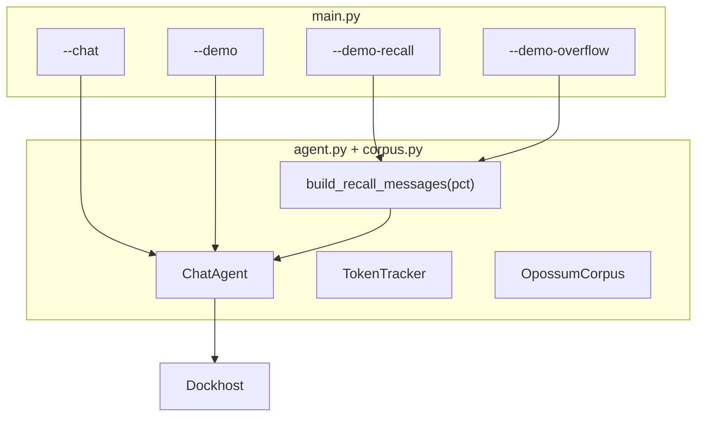

# Неделя 2, день 3 — подсчёт токенов и перегрузка контекста

## Модель

[`qwen/qwen3.5-9b`](https://dockhost.ru/prices) — 14/20 ₽ за 1M, окно **262 144** tok. Дефолт `DOCKHOST_MODEL=qwen/qwen3.5-9b`.

## Архитектура



| Файл | Назначение |
|------|------------|
| `agent.py` | `ChatAgent`, `TokenTracker`, `complete(messages)` без персистентности |
| `corpus.py` | Gutenberg-кэш, filler, **sweep recall** |
| `main.py` | CLI-режимы |
| `.cache/` | Кэш книг (`.gitignore`) |

## Подсчёт токенов

После каждого вызова — блок `[tokens]`:

| Метрика | Источник |
|---------|----------|
| Текущий запрос | `prompt_tokens - prev_prompt_tokens` |
| Вся история | `usage.prompt_tokens` |
| Ответ модели | `usage.completion_tokens` |

Плюс: стоимость ₽, `%` окна, накопление за сессию.

---

## Главная фишка: `--demo-recall` (sweep 10% → 95%)

### Идея

1. В **начале каждого прогона** (не через LLM) кладём короткий **анекдот про опоссумов** — его нужно запомнить и повторить.
2. Скрипт **набивает контекст** цитатами из Gutenberg-книг про опоссумов.
3. На **10%, 20%, … 95%** заполнения окна — **отдельный** API-вызов с мягким вопросом о recall (см. ниже).
4. В конце — **сводная таблица** всех ответов: как деградирует recall по мере роста контекста.

### Промпты: без «запомни» и «дословно» (важно для честности демо)

**Проблема жёстких инструкций:**

| Формулировка | Почему портит демо |
|--------------|-------------------|
| «Запомни анекдот» | Явно повышает salience раннего текста; модель «старается» удержать его сильнее, чем в обычном чате — **искусственно откладывает забывание**. |
| «Повтори дословно» | Жёсткий instruction-following: модель ищет точную цитату; провал может быть из‑за paraphrase, а не из‑за переполнения контекста. |
| Скриптованный assistant «Запомнил» | Лишний сигнал «это важно для диалога»; в реальности пользователь просто кидает текст и книги. |

**Что делаем вместо этого — естественный поток user-сообщений:**

```
system: Ты полезный ассистент. Отвечай кратко на русском.

user: Кстати, анекдот про опоссумов: «Почему опоссум не играет в прятки? …»

user: Фрагмент из Ecology of the Opossum (PG#37199): …
user: …ещё книги…

user: Какой анекдот про опоссумов я писал в самом начале?
```

- **Нет** «запомни», **нет** фейкового assistant между анекдотом и книгами.
- **Один** вызов LLM — только на финальный вопрос; до этого вся история user-only (+ system).
- Финальный вопрос **нейтральный**: «в самом начале» / «в первом сообщении» — без «дословно».
- Оценка recall: совпадение **ключевых слов** анекдота (опоссум, прятки, притворяется…), не побайтовое equality.

**Оговорка для видео (честность на уровне эксперта):**

- Анекдот в **начале** контекста — position bias: ранние токены часто держатся дольше (primacy). Демо показывает деградацию при **массовой** user-загрузке документов, но не «lost in the middle».
- Если на 95% модель всё ещё помнит — это тоже результат: «даже с явным началом при почти полном окне…»; на видео можно проговорить.
- Альтернатива на будущее (не в scope): вставить анекдот **после** 2–3 фрагментов книги — жёстче тест, сложнее калибровать %.

### Анекдот (константа в `corpus.py`)

Короткий, запоминающийся, на русском — ~2–3 предложения:

> Почему опоссум не играет в прятки? — Потому что когда его находят, он притворяется мёртвым, а потом всё равно проигрывает: он ведь не прятался, он «устал».

Первое user-сообщение (без «запомни»):

`"Кстати, анекдот про опоссумов: «…»"`

Финальный user-вопрос (константа `RECALL_QUESTION`):

`"Какой анекдот про опоссумов я писал в самом начале?"`

### Изолированные прогоны (важно)

**Каждый процент — новый `messages[]`, без накопления прошлых вопросов «повтори анекдот».**

На 20% в истории **нет** вопроса с 10% — только:

```
system
→ user (анекдот, casual)
→ user (фрагмент книги 1), user (фрагмент 2), … до ~20% окна
→ user «Какой анекдот … в самом начале?»
→ assistant ← единственный ответ LLM
```

Иначе модель «приучается» повторять после серии однотипных запросов.

Реализация: `build_recall_messages(fill_pct: int) -> tuple[list[dict], ContextMeta]` — каждый раз собирает историю с нуля; `ChatAgent.complete(messages)` **не** мутирует общую `_messages` агента.

### Filler — книги как user input (честнее)

**Не** симулируем диалог «расскажи про опоссумов → цитата ассистента». Вместо этого — как в реальном чате, когда пользователь **вставляет документы**:

```python
{"role": "user", "content": "Фрагмент из Ecology of the Opossum (PG#37199):\n\n[абзацы текста]"}
{"role": "user", "content": "Продолжение, Burgess Animal Book (PG#2441):\n\n[абзацы]"}
```

Почему честнее:

- Контент приходит от **user**, а не как будто модель уже «рассказывала» про опоссумов — нет фейковых assistant-reply.
- Ближе к реальному сценарию: paste документации / глав книги в контекст (как делают до RAG).
- Меньше сообщений → чуть меньше overhead на role-тokens; проще код.
- Recall-тест чище: модель должна помнить **ранний** user-анекдот среди **последующих** user-вставок, а не среди своих же «ответов».

Нарезка: абзацы ~1500–2500 символов, заголовок с PG# и названием книги. Добавляем user-сообщениями, пока `estimate_tokens(messages) < fill_pct * MODEL_CONTEXT_LIMIT`. При нехватке объёма — повтор корпуса (новые user-сообщения с пометкой «цикл 2»).

`ContextMeta` для лога:

```python
@dataclass
class ContextMeta:
    target_pct: int
    books: list[str]          # ["PG#37199 Ecology… (полностью)", "PG#2441 Burgess (42%)"]
    corpus_cycles: int
    user_chunks: int          # сколько user-сообщений с текстом книг
    estimated_tokens: int
    actual_prompt_tokens: int | None
```

### Вывод на каждом шаге

```
=== recall @ 40% ===
[context] цель: 40% (104858 / 262144 tok)
[context] загружено user-ом: PG#37199 (целиком), PG#2441 Burgess (фрагмент 38%)
[context] 12 user-фрагментов, корпус × 2 цикла
[context] анекдот: 1-е user-сообщение (без «запомни»); финальный вопрос — единственный recall-промпт
[tokens] prompt=102341 | completion=156 | ₽=1.47
[recall] ответ (156 sym): «Почему опоссум не играет…»
```

### Сводная таблица в конце

```
=== СРАВНЕНИЕ RECALL ===
  %  | prompt_tok | completion | ₽/вызов | recall (превью)
 10  |      28412 |         98 |  0.0040 | «Почему опоссум…» ✓
 20  |      55102 |        102 |  0.0077 | «Почему опоссум…» ✓
 ...
 80  |     212884 |         45 |  0.0290 | «Не помню анекдот» ✗
 95  |     251234 |         38 |  0.0352 | «…» ✗
→ На видео: как recall ломается при ~60–80% заполнения
```

Опционально: простая эвристика `✓/✗` — substring match ключевых слов анекдота в ответе (не LLM-judge).

### Чекпоинты и стоимость

- Полный sweep: **10, 20, 30, 40, 50, 60, 70, 80, 90, 95** — 10 вызовов.
- Суммарный input ≈ 525% одного окна → ~**1.37M tok** → **~19 ₽** (укладывается в 50 ₽).
- **`--demo-recall-quick`** для verify/smoke: только **10%, 50%, 90%** (~3 ₽).
- **`--demo-recall`** — полный sweep; **не запускать** в автоматическом verify (как overflow).

---

## Корпус Gutenberg (книги про опоссумов)

| PG# | Книга | ~tok |
|-----|-------|------|
| 37199 | Ecology of the Opossum | ~25k |
| 2441 | Burgess Animal Book | ~110k |
| 55704 | Wilderness Babies | ~40k |

Скачивание → `.cache/opossum_corpus.txt`. Для 95% (~249k) — циклическое повторение корпуса с логом `корпус × N`.

---

## Режимы CLI

### 1. `--chat` — интерактив

Как day-02 + `[tokens]` после каждого хода. Для видео: ручной диалог, рост токенов.

### 2. `--demo` — короткий vs длинный

~8–10 вызовов, **~0.05–0.15 ₽**:

- Фаза 1: 1 короткий вопрос
- Фаза 2: 5–6 ходов одной темы → таблица роста токенов/₽

*(Фаза «Томми/анекдот» убрана — recall вынесен в `--demo-recall`.)*

### 3. `--demo-recall` — sweep анекдота (главное шоу)

```bash
python weeks/week-02/day-03/main.py --demo-recall
```

10 изолированных прогонов 10→95%, сводная таблица. **~19 ₽** — запуск на видео.

Quick для разработки:

```bash
python weeks/week-02/day-03/main.py --demo-recall-quick
```

### 4. `--demo-overflow` — HTTP 400 (опционально)

Один вызов с `messages` > 262k (корпус × циклы + анекдот). **~4 ₽**. Только вы на видео; не в verify.

---

## ChatAgent

База: [day-02/agent.py](weeks/week-02/day-02/agent.py).

- `complete(messages) -> (content, usage, metrics)` — stateless, для recall/overflow.
- `run(user_input)` — для `--chat` с JSON-персистентностью.
- `ContextOverflowError` при HTTP 400.

---

## Проверка

1. `ruff check weeks/week-02/day-03/`
2. `python weeks/week-02/day-03/main.py --demo` — smoke
3. `python weeks/week-02/day-03/main.py --demo-recall-quick` — smoke recall (3 точки)
4. **Не запускать:** `--demo-recall` (полный), `--demo-overflow`

---

## Сценарий видео

1. `--clear --chat` — пара сообщений, `[tokens]`.
2. `--demo` — короткий vs длинный, таблица роста.
3. `--demo-recall` — sweep: анекдот → книги → «повтори» на 10…95%, финальная таблица деградации.
4. (опционально) `--demo-overflow` — HTTP 400.
