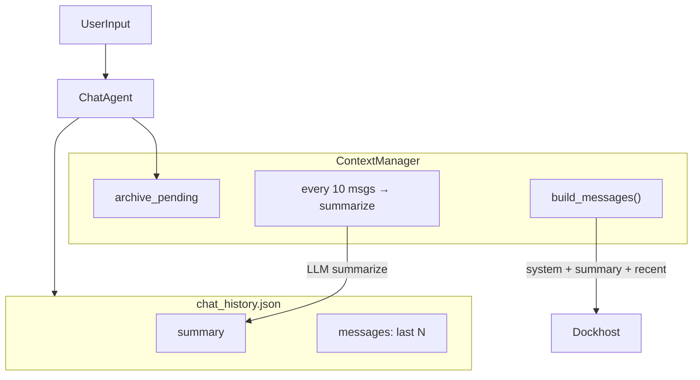

# Неделя 2, день 4 — сжатие истории

## Контекст и база

- [day-03](weeks/week-02/day-03/) уже даёт `ChatAgent`, `TokenTracker`, `[tokens]`-метрики, Dockhost-вызов — **копируем и расширяем**, не импортируем из соседней папки (конвенция курса: каждый день самодостаточен).
- Техника из [week2_summary.md](.cursor/rules/lessons/week2_summary.md): **History compression** — старые реплики → summary, последние N «как есть»; trade-off: экономия токенов vs потеря деталей.
- Папка [day-04](weeks/week-02/day-04/) сейчас пустая (только заглушка README).

## Архитектура



| Файл | Назначение |
|------|------------|
| [agent.py](weeks/week-02/day-04/agent.py) | `ChatAgent` + `TokenTracker` (из day-03) + интеграция с `ContextManager` |
| [context.py](weeks/week-02/day-04/context.py) | Логика сжатия, сборка messages для API, load/save summary |
| [main.py](weeks/week-02/day-04/main.py) | CLI: one-shot, `--chat`, `--demo-compare` |
| [requirements.txt](weeks/week-02/day-04/requirements.txt) | `requests`, `python-dotenv` |

## Механизм сжатия (`context.py`)

### Параметры (дефолты + CLI-override)

| Параметр | Дефолт | Смысл |
|----------|--------|-------|
| `keep_recent` | 6 | Последние N **user/assistant** сообщений без изменений |
| `compress_every` | 10 | Когда в «архивной» очереди ≥10 сообщений — сжимаем пачку |
| `enabled` | `True` | Режим без сжатия для сравнения |

### Алгоритм после каждого хода

1. Добавить `user` + `assistant` в полный лог (для персистентности и режима без сжатия).
2. Если `enabled=False` → в API уходит полный лог (как day-03).
3. Если `enabled=True`:
   - Держим `recent` (≤ N) и `archive_pending` (старше recent).
   - Когда `len(archive_pending) >= compress_every`: вызываем **отдельный** LLM-запрос summarize для этих 10 сообщений; результат **мерджим** в `_summary` (если summary уже есть — «обнови с учётом нового блока»).
   - Удаляем сжатые сообщения из `archive_pending`.
4. **Сборка контекста для основного вызова** (`build_messages()`):

```python
[
  {"role": "system", "content": system_prompt},
  # если summary есть:
  {"role": "user", "content": "Краткое содержание предыдущего диалога:\n{summary}"},
  {"role": "assistant", "content": "Понял, учту при ответах."},
  *recent_messages,
  {"role": "user", "content": current_input},  # уже в recent до вызова
]
```

Псевдо-ответ assistant после summary — стандартный приём, чтобы модель «приняла» контекст (как в лекции: summary как новая база).

### Персистентность

Формат [chat_history.json](weeks/week-02/day-04/chat_history.json):

```json
{
  "summary": "... или null",
  "messages": [ "... system + recent/full log ..." ]
}
```

При `--clear` — удалять файл. При загрузке восстанавливать и summary, и recent.

### Метрики сжатия

Расширить вывод после хода (рядом с `[tokens]`):

```
[compress] архив=12 | summary=340 sym | recent=6 | сжато +10 → summary обновлён
```

Отдельно учитывать токены **summarize-вызовов** в `TokenTracker` (они тоже стоят денег — честное сравнение).

## Изменения в `ChatAgent` ([agent.py](weeks/week-02/day-04/agent.py))

- Конструктор: `compression: CompressionConfig | None` → создаёт `ContextManager`.
- `run()`: не слать `_messages` напрямую; `ctx.build_messages(user_input)` → `_complete_messages()`.
- После ответа: `ctx.on_turn_complete(user, assistant)` — триггер сжатия.
- `complete(messages)` — stateless, без сжатия (для совместимости, если понадобится).
- Свойство `compression_stats` для демо-таблицы.

Ключевой фрагмент из day-03, который сохраняем:

```165:171:weeks/week-02/day-03/agent.py
    def run(self, user_input: str) -> str:
        self._messages.append({"role": "user", "content": user_input})
        content, _usage, metrics = self._complete_messages(self._messages)
        self._messages.append({"role": "assistant", "content": content})
        self._last_metrics = metrics
        save_history(self._history_path, self._messages)
        return content
```

Заменяем на вызов через `ContextManager`, сохраняя `TokenTracker` / `print_tokens`.

## CLI и демо ([main.py](weeks/week-02/day-04/main.py))

### Режимы

| Команда | Назначение |
|---------|------------|
| `python weeks/week-02/day-04/main.py` | One-shot (сжатие **вкл**) |
| `--clear --chat` | Интерактив с `[tokens]` + `[compress]` |
| `--no-compress --chat` | Чат без сжатия |
| **`--demo-compare`** | **Главное шоу для видео** |

### `--demo-compare` — сценарий сравнения

Один прогон, ~14–16 LLM-вызовов + 1–2 summarize (~1–3 ₽):

1. **Сeed-факт** (из day-03): анекдот про опоссумов — casual user-сообщение.
2. **12 filler-ходов**: короткие вопросы про контекст/LLM (переиспользуем `DEMO_LONG_PROMPTS` из day-03 + 6 повторов/вариаций — без Gutenberg, дёшево).
3. **Recall-вопрос**: «Какой анекдот про опоссумов я писал в самом начале?»
4. Повторить **тот же скрипт** дважды:
   - **A: без сжатия** (`enabled=False`) — растущий `prompt_tok`.
   - **B: со сжатием** (`keep_recent=6`, `compress_every=10`) — plateau после первого summarize.

**Таблица в stdout:**

```
=== СРАВНЕНИЕ СЖАТИЯ ===
  режим     | ход | prompt_tok | ₽/ход | recall
  без       |  14 |      8200  | 0.03  | ✓
  со сжатием|  14 |      2100  | 0.01  | ✓/✗
→ сессия без: 45000 tok, ₽0.15
→ сессия сжатие: 12000 tok (+2800 summarize), ₽0.05
```

Recall-проверка: эвристика по ключевым словам из day-03 (`опоссум`, `прятки`, `притворяется`) — без отдельного LLM-саммари (экономия).

### Флаги

- `--clear` — сброс истории
- `--no-compress` — отключить сжатие
- `--keep N`, `--compress-every N` — настройка для экспериментов на видео

## Документация

- [README.md](weeks/week-02/day-04/README.md): задание, команды, сценарий видео (3 шага: `--demo-compare` → `--chat` с `[compress]` → показать `chat_history.json` с полем `summary`).
- [journal/week-02/day-04.md](journal/week-02/day-04.md): что сделали, trade-off recall vs токены, оценка стоимости демо.

## Проверка (verify-after-code)

1. `ruff check weeks/week-02/day-04/`
2. Без API: `--help`, загрузка/сохранение JSON (можно unit-less smoke через mock — не обязательно).
3. **Один** LLM-прогон: `python weeks/week-02/day-04/main.py --clear "тест"` (~0.01 ₽).
4. Полное `--demo-compare` — только перед записью видео (~1–3 ₽); в verify достаточно укороченного варианта `--demo-compare-quick` (6 ходов вместо 12) если добавим флаг — опционально для CI-smoke.

## Сценарий видео (one command flow)

```bash
source .venv/bin/activate
python weeks/week-02/day-04/main.py --demo-compare
```

На записи видно: рост токенов без сжатия, plateau со сжатием, recall ✓/✗, блок `[compress]` при summarize.

## Что сознательно не делаем

- Gutenberg/recall-sweep из day-03 — дорого и не про compression напрямую.
- Sliding window / vector memory — другие техники, не тема дня.
- tiktoken — остаёмся на `usage.prompt_tokens` из API (как day-03).
