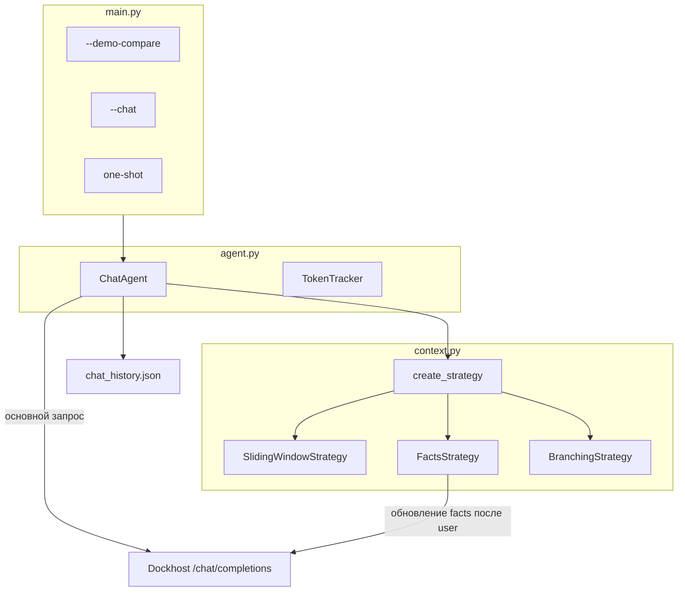

# Week 2 Day 5: три стратегии контекста

## Контекст

- Задание: **без summary** (в отличие от [day-04](weeks/week-02/day-04/)) — три других техники из лекции: sliding window, key-value facts, topic branches.
- Базовый паттерн репо: Dockhost API + `TokenTracker` + `chat_history.json` — как в [day-04/agent.py](weeks/week-02/day-04/agent.py).
- Папка `weeks/week-02/day-05/` **создаётся с нуля** (на диске её пока нет).

## Архитектура



**Разделение ответственности:**
- `context.py` — только логика контекста (без HTTP); стратегии реализуют общий интерфейс.
- `agent.py` — LLM-вызов, метрики, передаёт `complete_fn` в facts-стратегию для side-effect LLM.
- `main.py` — CLI, сценарий демо, таблица сравнения.

## Файлы

| Файл | Назначение |
|------|------------|
| [weeks/week-02/day-05/context.py](weeks/week-02/day-05/context.py) | `StrategyKind`, `ContextConfig`, ABC `ContextStrategy`, 3 реализации, `create_strategy()` |
| [weeks/week-02/day-05/agent.py](weeks/week-02/day-05/agent.py) | `ChatAgent`, `TokenTracker` (+ `extra_*` для facts), Dockhost POST |
| [weeks/week-02/day-05/main.py](weeks/week-02/day-05/main.py) | CLI, `--demo-compare`, интерактив |
| [weeks/week-02/day-05/requirements.txt](weeks/week-02/day-05/requirements.txt) | `requests`, `python-dotenv` |
| [weeks/week-02/day-05/README.md](weeks/week-02/day-05/README.md) | Запуск, сценарий видео, статус сдачи |
| [journal/week-02/day-05.md](journal/week-02/day-05.md) | Краткий журнал после прогона |

## Стратегия 1: Sliding Window

```python
# build_messages: system + messages[-N:] + new user
# on_turn_complete: append pair, trim to last N messages
```

- `--window N` (default **6**) — намеренно мало для демо: при 12+ ходах ранние решения выпадают.
- Persist: `{strategy, window_size, messages}` в `chat_history.json`.
- Stdout: `[context] отброшено K старых сообщений (окно=N)`.

## Стратегия 2: Sticky Facts (Key-Value)

**Хранилище:** `dict[str, str]` — цель, бюджет, стек, ограничения и т.д.

**После каждого user-сообщения** (до append в recent):
1. Side LLM-вызов с промптом «извлеки/обнови факты → JSON `{ключ: значение}`».
2. Merge в `_facts` (перезапись ключей).

**В основной запрос:**
```
system
[user: "Известные факты:\n- бюджет: ...\n- стек: ..."]
[assistant: "Понял, учту эти факты."]
+ последние N сообщений
+ новый user
```

### Вывод фактов в stdout (новое)

После каждого хода в стратегии `facts` — **явно печатать текущий блок фактов**, чтобы на демо было видно, что агент «помнит»:

```
[facts] 4 записи:
  - бюджет: не более 500 000 ₽
  - срок: 3 месяца
  - стек: Flutter + Python/FastAPI
  - оплата: только картой, без наличных
```

Реализация:
- `FactsStrategy` — метод `format_facts()` / property `facts` (уже нужен для build_messages).
- `agent.py` — `print_facts(stats)` или вызов из `print_strategy_stats()` когда `strategy == facts`.
- В `--demo-compare` — блок `[facts]` после каждого хода facts-стратегии (не только в конце).
- При обновлении facts — если ключи изменились, можно добавить `(+2 новых, ~1 обновлён)` в `[context]`.

- Extra-токены facts-вызовов — отдельно в `TokenTracker.extra_prompt_tokens`, плюс в итоговой таблице.
- Persist: `{strategy, window_size, facts, messages}`.
- Парсинг JSON: strip markdown fences, `json.loads`, мягкий fallback при ошибке (не падать).

## Стратегия 3: Branching

**Структура:**
- `_shared: list[message]` — общий префикс до checkpoint
- `_branches: dict[name, list[message]]` — независимые хвосты
- `_active_branch: str | None`
- `_checkpoint_at: int | None`

**API (через `ChatAgent` → strategy):**
- `create_checkpoint()` — запомнить `checkpoint_at = len(_shared)`
- `fork_branches("payment", "delivery")` — обрезать `_shared` до checkpoint, создать 2 пустые ветки, активировать первую
- `switch_branch(name)` — переключение

**build_messages:** `system + shared + branch[active] + user`

**Интерактив (`--chat --strategy branching`):** команды `/checkpoint`, `/fork A B`, `/switch NAME`

Persist: `{strategy, checkpoint_at, active_branch, shared, branches}`.

## CLI ([main.py](weeks/week-02/day-05/main.py))

```
python weeks/week-02/day-05/main.py                          # one-shot
python weeks/week-02/day-05/main.py --strategy facts "..."   # переключатель
python weeks/week-02/day-05/main.py --clear --chat           # интерактив
python weeks/week-02/day-05/main.py --demo-compare           # полное сравнение
python weeks/week-02/day-05/main.py --demo-compare-quick     # smoke (~8 ходов)
python weeks/week-02/day-05/main.py --window 4 --demo-compare-quick
```

Флаги: `--strategy {sliding,facts,branching}`, `--window N`, `--clear`, `--chat`.

## Демо-сценарий: сбор ТЗ для опоссумов

**Тон:** тот же каркас (12 ходов + recall, fork payment/delivery), но **клиенты, сотрудники и разработчики — опоссумы**. Лёгкое безумие, как day-04 с опossum-диалогом, но формально это сбор ТЗ на MVP.

System prompt агента: «Ты ассистент по сбору ТЗ. Клиенты, разработчики и сотрудники — опоссумы. Веди диалог структурированно, фиксируй решения. Отвечай кратко на русском, можно с лёгким юмором про опossum-контекст.»

### Общая часть (sliding + facts), ~12 ходов

**Shared (5 сообщений — ранние решения для recall):**

1. «Начинаем собирать ТЗ для MVP приложения доставки еды для опоссумов. Заказчик — стартап OpossumEats, команда тоже из опоссумов.»
2. «Бюджет MVP — не более 500 000 ₽, срок — 3 месяца. CTO-опоссум не терпит срывов дедлайна.»
3. «Стек: Flutter (мобилка для лапок), бэкенд Python/FastAPI. DevOps-опоссум настаивает.»
4. «На старте только оплата картой — опossumы не носят наличные в сумке.»
5. «Целевая аудитория — студенты-опossumы и офисные опossumы 20–35 лет, ночной образ жизни.»

**Filler (7 сообщений — раздувают окно, sliding их «съест»):**

6. «Каталог ресторанов: фильтр по кухне — черви, ягоды, «городская классика» (мусорные баки). Рейтинг по звёздам и хвостам.»
7. «Корзина: несколько позиций, промокод OPOSSUM10, минимальный заказ — 3 жука или эквивалент.»
8. «Push-уведомления о статусе заказа и акциях «Мёртвая доставка — скидка 15%».»
9. «Админка для ресторанов-опossumов: меню, цены, часы работы (ночь — приоритет).»
10. «Аналитика: конверсия, средний чек в жуках, retention за 7/30 дней.»
11. «Юридическое: оферта, политика ПДн для опossum-пользователей, согласие на push.»
12. «Мониторинг: Sentry для клиента, Grafana для бэкенда. On-call — дежурный опossum.»

**Recall (13-й ход):**
«Напомни: какой бюджет, срок и стек мы зафиксировали в начале диалога? И кто у нас заказчик?»

**Recall-проверка (эвристика):** ответ содержит `500`, `месяц`/`3`, `flutter` (заказчик OpossumEats — опционально в выводе, не в ✓/✗).

### Branching-сценарий

- Shared: первые 5 сообщений выше
- Checkpoint + fork → `payment` / `delivery`

**Ветка payment (3 + recall):**
- «Ветка оплаты: интеграция с ЮKassa и Apple Pay — опossum платит лапкой.»
- «Комиссия платёжки не более 2.5%, возвраты за 24 часа (если опossum не притворился мёртвым).»
- «Чеки 54-ФЗ через облачную кассу.»
- Recall (тот же вопрос про бюджет/срок/стек)

**Ветка delivery (3 + recall):**
- «Ветка доставки: курьеры-опossumы, радиус 5 км от ресторана.»
- «SLA доставки — 45 минут, трекинг на карте. Курьер может «играть в dead» при опоздании — запрещено.»
- «При задержке — промокод 10% на следующий заказ.»
- Recall

Recall ✓ если обе ветки воспроизвели бюджет/срок/стек из shared.

### Таблица сравнения (stdout)

```
стратегия  | recall | prompt_tok | extra_tok | facts | ₽ сессия
sliding    | ✗/✓    | ...        | —         | —     | ...
facts      | ✓      | ...        | ...       | N     | ...
branching  | ✓      | ...        | —         | —     | ...
```

+ блок «выводы»: стабильность, min/max токены, UX.

**Ожидаемое поведение при window=6:**
- **Sliding:** recall ✗ — бюджет/срок/стек выпали из окна среди жуков и мусорных баков
- **Facts:** recall ✓ — блок `[facts]` на видео показывает сохранённые ключи
- **Branching:** recall ✓ на обеих ветках — shared-префикс сохранён

## Переиспользование из day-04

Из [day-04/agent.py](weeks/week-02/day-04/agent.py) взять без изменения смысла:
- `load_agent_config()`, `.env` через `parents[3]`
- `MODEL_CONTEXT_LIMIT`, `PRICE_IN_M/OUT_M`, `TurnMetrics`, `print_tokens()`

## Проверка (verify-after-code)

1. `ruff check weeks/week-02/day-05/`
2. Smoke без LLM: `python weeks/week-02/day-05/main.py --help`
3. Один LLM-прогон: `python weeks/week-02/day-05/main.py --demo-compare-quick`
4. Полное демо для видео: `--demo-compare` (~1–3 ₽)

## Сценарий видео (README)

1. `--demo-compare` — таблица, sliding теряет бюджет среди опossum-filler, facts показывает `[facts]` блок, branching — fork payment/delivery
2. `--clear --chat --strategy facts` — пара реплик, смотрим обновление `[facts]` после каждого хода
3. `--clear --chat --strategy branching` — `/checkpoint`, `/fork payment delivery`, `/switch`
4. Показать `chat_history.json` — `facts` vs `shared`/`branches`

## Что сознательно не делаем

- Summary/compression (это day-04)
- RAG/embeddings (не тема дня)
- Тесты pytest (нет смысла без моков LLM)
- Отдельные history-файлы per strategy (достаточно `reset_history()` между прогонами демо)

## Todos

- [ ] Создать weeks/week-02/day-05/ — requirements.txt, context.py (ABC + 3 стратегии + persist)
- [ ] agent.py: ChatAgent, TokenTracker с extra-токенами facts, run() + branch API, **print_facts()**
- [ ] main.py: --strategy, --chat, --demo-compare(-quick), **opossum-сценарий ТЗ**, таблица сравнения
- [ ] README.md (по шаблону day-04) + journal/week-02/day-05.md после прогона
- [ ] ruff check + --demo-compare-quick (один LLM-smoke)
