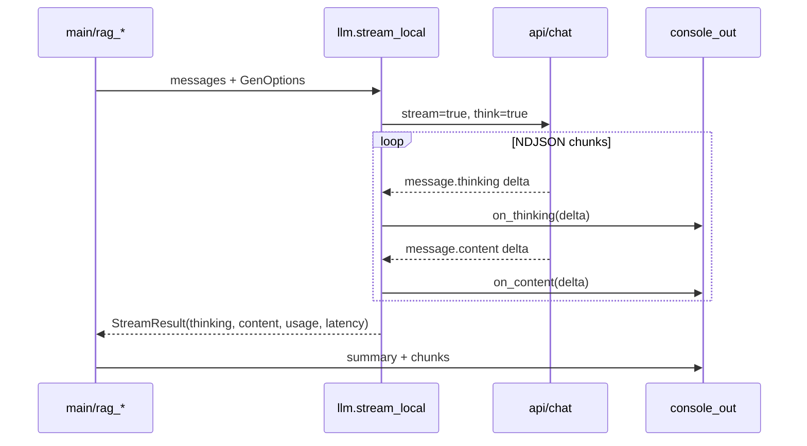

# Streaming reasoning + answer для day-04

## Диагноз

Сейчас [`llm.py`](weeks/week-06/day-04/llm.py) вызывает `/api/chat` с **`think: false`**. У qwen3:4b модель всё равно «думает» вслух — но текст попадает в **`message.content`**, съедает `num_predict` (1024) и до нормального ответа не доходит.

При **`think: true` + `stream: true`** Ollama разделяет потоки (проверено локально):

- `message.thinking` — дельты размышлений
- `message.content` — дельты ответа (после thinking)

## Целевой UX (stdout для видео)

```
[thinking] Hmm, the excerpts mention…     ← стрим, dim-цвет, без перевода строки до конца блока
[rag-rerank] На первом месте дикий…      ← стрим ответа, обычный цвет
[rag-rerank] 3 chunks · 45230 ms          ← итог после завершения
[chunks-rerank] …                         ← метаданные чанков (как сейчас)
```

То же для simple: `[thinking]` → `[answer-rag]` → latency в `[local]`.



## Изменения по файлам

### 1. [`profiles.py`](weeks/week-06/day-04/profiles.py) — лимиты

| Параметр | Было | Станет |
|---|---|---|
| cite `max_tokens` | 1024 | **4096** |
| simple `max_tokens` | 256 | **2048** |
| `num_ctx` | 8192 | **8192** (оставить) |

`num_predict` при `think=true` покрывает thinking + answer; 4096 — запас под длинный RAG-контекст.

### 2. [`llm.py`](weeks/week-06/day-04/llm.py) — streaming API

- Новый dataclass `StreamResult`: `thinking`, `content`, `usage`, `latency_ms`
- Новая функция **`stream_local()`**:
  - `POST /api/chat`, `stream: true`, **`think: true`**
  - парсинг NDJSON построчно (`response.iter_lines()`)
  - колбэки `on_thinking(delta: str)` / `on_content(delta: str)` (optional)
  - накопление полных строк в `StreamResult`
  - финальный chunk (`done: true`) → `usage` из `prompt_eval_count` / `eval_count`
- `complete_local()` — thin wrapper над `stream_local()` без колбэков (для совместимости) или удалить и везде использовать `stream_local`
- `check_ollama`: `think=on (stream)`

### 3. [`console_out.py`](weeks/week-06/day-04/console_out.py) — интерактивный вывод

Новые хелперы:

- `begin_stream_section(tag)` — печатает `[tag] ` один раз
- `write_stream_delta(text, *, tag)` — `sys.stdout.write(text); flush`, цвет по tag
- `end_stream_section()` — `\n\n` в конце блока

Стили:
- `thinking` → dim (`90`)
- `rag-rerank` / `rag-wide` / `answer-rag` → существующие BODY_STYLE

Учитывать `NO_COLOR` / non-tty (как сейчас в `use_color()`).

### 4. [`rag_cite.py`](weeks/week-06/day-04/rag_cite.py)

- `generate_cite_rag()` вызывает `stream_local()` с колбэками:
  - thinking → `begin_stream_section("thinking")` + deltas
  - content → `begin_stream_section("rag-{mode}")` + deltas (mode = rerank/wide)
- `RagResponse`: добавить поле `thinking: str` (для отладки/журнала)
- `answer_insufficient()` — без изменений (по финальному `content`)

### 5. [`rag_simple.py`](weeks/week-06/day-04/rag_simple.py)

- Аналогично: `stream_local()` → `[thinking]` → `[answer-rag]`
- Возвращает `(answer, latency_ms)` как сейчас

### 6. [`main.py`](weeks/week-06/day-04/main.py)

- `_print_rag_block()`: **не дублировать** уже отстримленный answer — только `format_rag_summary()` + `chunks-*`
- Убрать лишний `print_section(f"rag-{stage}", resp.answer)` (ответ уже на экране)

### 7. [`README.md`](weeks/week-06/day-04/README.md) + journal

- Обновить таблицу лимитов
- Описать stdout: `[thinking]` стрим → `[rag-*]` / `[answer-rag]` стрим
- Заметка: reasoning через `/api/chat think=true`; для видео видно прогресс генерации

## Scope — чего не делаем

- Cloud translate (Dockhost) — без стриминга
- JSON-формат ответа — не возвращаем
- `--no-stream` флаг — не добавляем (всегда stream для локальной генерации day-04)
- Другие дни week-06 — не трогаем

## Проверка

1. `ruff check weeks/week-06/day-04/`
2. Smoke без LLM: `--show-index`
3. Один интеграционный прогон: `--ask "…" --mode cite` — в stdout видны два блока (thinking → answer), ответ не обрывается на «Hmm, let me think…»
4. `--demo --no-pause` — для записи видео пользователем
