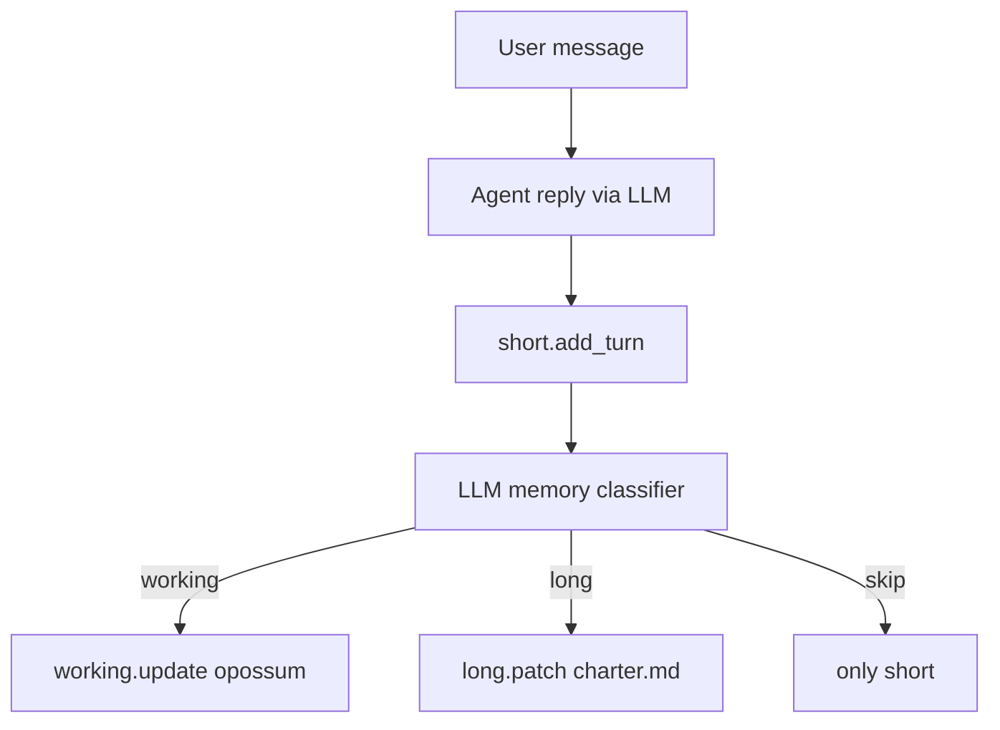

# Week 3 Day 01 — модель памяти «Хвостик» (v2)

## Контекст

- [`weeks/week-03/day-01/`](weeks/week-03/day-01/) — старт с нуля.
- Scope: только memory layers (без FSM, инвариантов, профилей).
- **Изменения по фидбеку:** seed long = только `charter.md`; Пушок появляется в demo; маршрутизация через **LLM-классификатор**; один `--demo` с **тремя диалогами**; без `--demo-quick`.

## Три слоя памяти

| Слой | Содержимое | Хранение | Когда пишем |
|------|------------|----------|-------------|
| **short** (диалог) | реплики текущей сессии | `data/short/dialog.json` | **каждый ход** автоматически |
| **working** (уровень 2) | факты **по каждому опossumу** (приём, симптомы, наблюдения) | `data/working/<name>.json` | LLM-классификатор → `layer: working` |
| **long** (уровень 1) | **правила приюта** (устав) | `data/long/charter.md` | seed + LLM-классификатор → `layer: long` |

Болтовня и несущественное → классификатор возвращает пустой `saves[]` → остаётся только short.

## Архитектура



**Prompt builder:** system = роль ассистента + `long.to_prompt_block()` + `working.all_opossums_block()`; messages = short history + user.

## LLM-классификатор (`classifier.py`)

Отдельный вызов Dockhost **после каждого хода** (по аналогии с `FactsStrategy` в [`context.py`](weeks/week-02/day-05/context.py)):

- Вход: последние N реплик short + текущий user/assistant + текущее содержимое working/long (кратко).
- System: явные определения слоёв — **long** = только правила/режим/регламент приюта; **working** = данные конкретного опossuma; иначе не сохранять.
- Ответ: JSON, напр. `{"saves": [{"layer": "working", "opossum": "Пушок", "facts": {"reason": "...", "weight_kg": "..."}}, {"layer": "long", "patch": "Рабочие часы: 18:00–08:00"}]}` или `{"saves": []}`.
- **Код агента** (разработчик) задаёт whitelist: принимаем только `working` и `long`, применяем через `MemoryStore.apply_save()` — LLM предлагает, код решает **куда** можно писать.
- stdout: `[memory] classifier → working: Пушok +3 facts` / `long: charter updated` / `skip (chat only)`.

## Seed-данные

**Только** [`data/long/charter.md`](weeks/week-03/day-01/data/long/charter.md):

- ночная смена **20:00–06:00** (изменится в demo-3);
- «игра мёртvого» — норма;
- карантин 14 дней перед усыновлением;
- без vet clearance нельзя обещать выдачу.

`data/working/` — **пусто** на старте. Карточки опossumов **не** в seed — появляются в demo.

## Структура файлов

```
weeks/week-03/day-01/
  main.py
  agent.py
  memory.py
  classifier.py      # LLM → saves[]
  llm.py
  user_sim.py
  data/
    long/charter.md
    working/           # runtime: pushok.json и др.
    short/dialog.json
  requirements.txt
  README.md
```

CLI:

```
python weeks/week-03/day-01/main.py --demo
python weeks/week-03/day-01/main.py --chat
python weeks/week-03/day-01/main.py --show-memory
python weeks/week-03/day-01/main.py --clear short|working|all-long-reset
```

`--clear short` между диалогами в demo; working/long накапливаются между сессиями.

## Demo: три диалога (один `--demo`)

Между диалогами: `[demo] --- новая сессия ---`, `memory.clear_short()`, working/long сохраняются.

### Диалог 1 — приём Пушка (Марта)

Цель: working пуст → после ходов появляется `working/pushok.json`.

| Ход | Hint user_sim | Ожидание |
|-----|---------------|----------|
| 1 | принесли опossuma, зовут Пушок, нашли у дороги | classifier → working: имя, обстоятельства |
| 2 | вес ~1.2 кг, вялый, без видимых ран | working: симптомы |
| 3 | положили в карантин, день 1 | working: статус карантина |
| 4 | болтовня/усталость (опционально) | skip → только short |

### Диалог 2 — следующий день (Марта)

Новая short-сессия; working уже с Пушком.

| Ход | Hint | Ожидание |
|-----|------|----------|
| 1 | как Пушок после ночи? | ответ из **working** (вчерашние факты) |
| 2 | сегодня ел нормально, активнее | classifier → working: доп. наблюдение |
| 3 | когда можно отдавать в семью? | ответ из **long** (карантин 14 дней) |
| 4 | что зафиксировали по Пушку? | recall working, не болтовня из short |

### Диалог 3 — директор меняет часы

Персонаж: **директор приюта** (отдельный system prompt в user_sim).

| Ход | Hint | Ожидание |
|-----|------|----------|
| 1 | с нового месяца смена 18:00–08:00, зафиксируй в уставе | classifier → **long**: patch charter.md |
| 2 | подтверди новые часы | agent цитирует обновлённый **long** |

Финал demo: `[memory] dump` всех трёх слоёв + краткий ✓/✗ чеклист (Пушок в working, часы в long, short пуст после последней сессии или только её реплики).

## `user_sim.py`

- Персонажи: `martha`, `director` — разные system prompts.
- Полный transcript текущего диалога + hints на ход (как [`client_sim.py`](weeks/week-02/day-05-bonus/client_sim.py)).
- Ответ — только текст пользователя.

## Вывод stdout (неделя 3)

- `[demo] dialog 1/2/3` — границы сессий
- `[user]` / `[agent]` — **полностью**
- `[memory]` — результат classifier + dump слоёв
- `[tokens]` — usage (агент + classifier отдельно или суммарно)

## README и журнал

- README: одна команда `--demo`, описание 3 слоёв и 3 диалогов.
- `journal/week-03/day-01.md` после реализации.

## Проверка

1. `ruff check weeks/week-03/day-01/`
2. `--show-memory` без API
3. Один прогон `--demo` с `DOCKHOST_AI_KEY`

## Чего не делать

- `--demo-quick`
- seed-карточка Пушка в long/working
- if/else маршрутизация вместо classifier
- MCP, RAG, FSM, инварианты, профили ролей
- хардкод реплик пользователя
