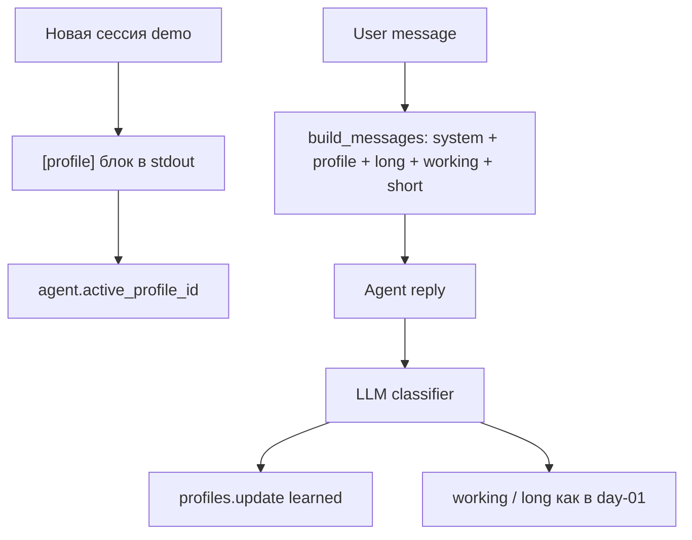

# Week 3 Day 02 — персонализация ассистента

## Scope

**Входит:** профили пользователей поверх памяти day-01; подключение профиля к prompt; расширение классификатора; `--demo` с тремя персонажами и новым сюжетом (Лапка).

**Не входит:** FSM, инварианты, transition guards (day-03+).

## Старт: копия day-01

Скопировать в [`weeks/week-03/day-02/`](weeks/week-03/day-02/) весь код и `data/` из [`weeks/week-03/day-01/`](weeks/week-03/day-01/), затем править только day-02.

Убрать из demo сюжет про Пушка; working/long в начале demo сбрасываются как сейчас (`clear_working`, `reset_long`).

## Архитектура



Профиль — **отдельный слой** (не short/working/long), файлы в `data/profiles/`.

## Три seed-профиля

Файлы: `data/profiles/martha.json`, `klyk.json`, `director.json`.

| ID | Кто | Стиль | Формат | Constraints (начальные) |
|----|-----|-------|--------|---------------------------|
| `martha` | **Марта**, смотритель | тёплый, практичный, лёгкий opossum-юмор | пошаговые списки «что сделать сейчас» | не паниковать из-за dead play; нужны конкретные действия на смене |
| `klyk` | **доктор Клык**, ночной ветеринар | сухой клинический, без метафор | протокол: наблюдение → оценка → действие; единицы измерения | только факты и дозировки; ссылаться на vet clearance из устава |
| `director` | **директор приюта** | деловой, авторитетный | executive summary, 2–4 предложения | без мед. жути и графики; фокус на рисках, сроках, соответствии уставу |

Поле `learned: {}` — пустое в seed; сюда классификатор пишет уточнения из диалога.

## Новый модуль [`profiles.py`](weeks/week-03/day-02/profiles.py)

- `UserProfile` dataclass: `id`, `name`, `role`, `style`, `format`, `constraints[]`, `learned{}`.
- `ProfileStore(data_dir)`: `load()`, `get(id)`, `all()`, `to_prompt_block(profile)`, `apply_update(updates)`, `reset_to_seed()`, `dump_line()`.
- `to_prompt_block()` — компактный markdown-блок для system prompt.
- `format_profile_stdout(profile)` — человекочитаемый блок для `[profile]` в начале чата.

## Изменения в [`agent.py`](weeks/week-03/day-02/agent.py)

- Поле `profiles: ProfileStore`, `active_profile_id: str`.
- `DEFAULT_SYSTEM` — убрать «собеседник — смотритель или директор»; роль берётся из профиля.
- `build_messages()` — после базового system добавить:

```python
f"## Профиль собеседника\n{self.profiles.to_prompt_block(active)}"
```

- `classify_turn(...)` — передавать `profile_id` и `ProfileStore`.
- `create_agent()` — инициализировать `ProfileStore`, дефолт `active_profile_id="martha"`.

## Расширение [`classifier.py`](weeks/week-03/day-02/classifier.py)

Добавить третий whitelist-слой **profile**:

```json
{"layer": "profile", "updates": {"learned": {"ключ": "значение"}}}
```

Правила в `CLASSIFIER_SYSTEM`:
- сохранять **явные** предпочтения пользователя о формате/стиле/ограничениях («запомни», «всегда», «мне удобнее», «отчёты только…»);
- не дублировать то, что уже в seed-профиле;
- working/long — без изменений.

`memory.apply_save` не трогаем; `ProfileStore.apply_update()` вызывается из classifier. В stdout: `[profile] classifier → martha: +ночной_формат: короткие списки`.

## Demo-сценарий: опоссум **Лапка** (хвостовая травма)

Три **отдельные сессии** (между ними `clear_short`, working/long/profiles сохраняются). По **2–3 хода** на персонажа → **7–8** `[user]`-реплик.

Общая линия: в working накапливаются факты о Лапке; в `learned` каждого профиля — по одному новому предпочтению.

### Сессия 1 — Марта (`martha`, 3 хода)

Hints в [`user_sim.py`](weeks/week-03/day-02/user_sim.py):
1. Принесли Лапку: нашли у забора, хвост повреждён, играет мёртвой — переживаю.
2. Вес ~1.1 кг, рана на хвосте чистая, карантин в боксе B3, день 1.
3. **«Запомни: ночью мне удобнее короткие ответы списком, без длинных вступлений»** → ожидаем `profile.learned`.

### Сессия 2 — доктор Клык (`klyk`, 2–3 хода)

`prior_summary` **пустой** (другой персонаж, по правилам week-03).
1. Статус пациента Лапка: хвост, риск инфекции — нужен протокол наблюдения.
2. (опционально) Уточнение: аппетит нормальный, температура в норме.
3. **«Всегда указывай дозировки в мг/кг, без народных сравнений»** → `profile.learned`.

Ответы агента: сухой протокол, без «успокойся» — контраст с Мартою.

### Сессия 3 — директор (`director`, 2–3 хода)

`prior_summary` пустой.
1. Краткий статус по приёму Лапки: риски, сроки карантина, без мед. подробностей.
2. Тот же вопрос что у Марты, но по-своему: «волонтёры паникуют из-за dead play у Лапки — что им сказать?» → короткий управленческий ответ.
3. **«Фиксируй: отчёты директору — только факты и риски, без эмоций»** → `profile.learned`.

### Проверка персонализации на видео

Один и тот же домен (dead play / Лапка), **разный тон** в трёх сессиях — видно без A/B в одном чате.

## [`user_sim.py`](weeks/week-03/day-02/user_sim.py)

- Добавить persona `klyk` + `KLYK_SYSTEM` (клинический тон).
- Сценарии: `lapka_intake`, `lapka_vet`, `lapka_director`.
- Функции `martha_lapka_turns()`, `klyk_lapka_turns()`, `director_lapka_turns()`.
- Убрать/не использовать `dialog1/2/3_turns` из day-01.

## [`main.py`](weeks/week-03/day-02/main.py)

- `print_demo_intro()` — добавить строку про профили и план 3 сессий.
- `run_dialog()` — параметр `profile_id`:
  - `agent.active_profile_id = profile_id`
  - в начале сессии: `print_profile_block(agent.profiles.get(profile_id))` с меткой `[profile]`
- `cmd_demo()` — три сессии вместо трёх диалогов day-01; между сессиями `clear_short`.
- `demo_checklist()`:
  - ✓ Лапка в working (N фактов)
  - ✓ у каждого профиля `learned` не пустой (≥1 ключ)
  - ✓ профили различаются в seed (style/constraints)
- `print_memory_event()` — также печатать `[profile]` события классификатора.
- `--show-memory` — добавить секцию profiles.
- `--clear` — опция `profiles` (сброс к seed JSON).

## README и журнал

- [`weeks/week-03/day-02/README.md`](weeks/week-03/day-02/README.md) — задание, запуск, метки stdout, чеклист на видео.
- [`journal/week-03/day-02.md`](journal/week-03/day-02.md) — кратко после реализации.

## Проверка

1. `ruff check weeks/week-03/day-02/`
2. `python weeks/week-03/day-02/main.py --show-memory` (без LLM)
3. Один `python weeks/week-03/day-02/main.py --demo` с API — убедиться: `[profile]` в начале сессий, ответы разного стиля, `learned` заполнен, Лапка в working.
