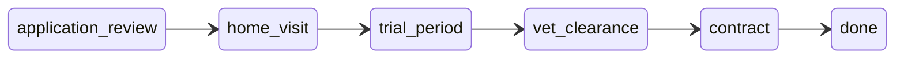
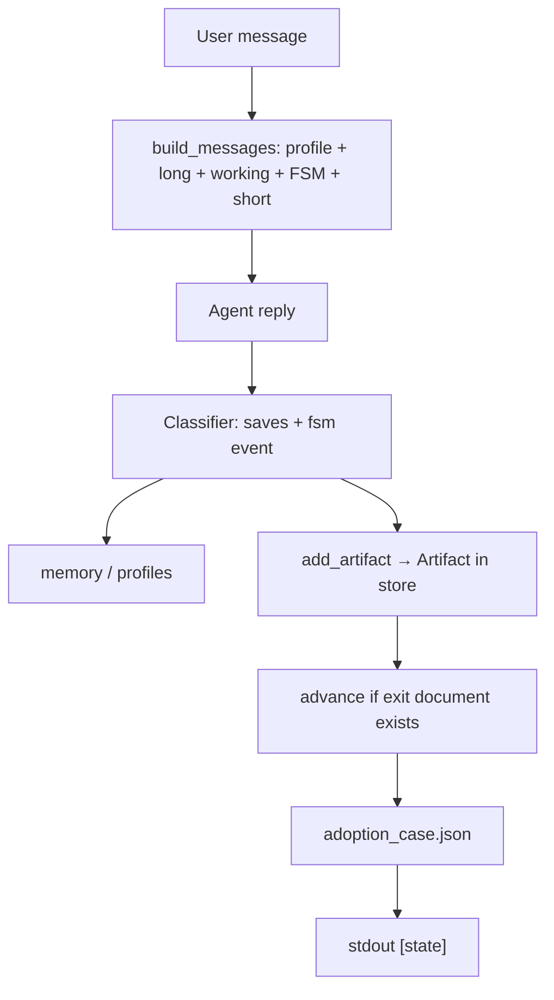
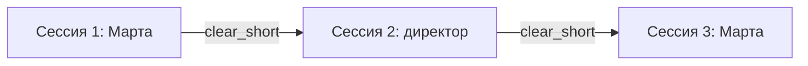

# Week 3 Day 03 — Task State Machine + артефакты-документы

## Scope

**Входит (только day-03):**
- FSM активной заявки: `stage`, `step`, `expected_action`, `paused`
- **Артефакты** — документы/результаты этапа (не события)
- **События FSM** — отдельно: `add_artifact`, `advance`, `pause`, `resume`, `update_step`
- Линейный `advance` только при наличии exit-документа текущего этапа
- Persist в `data/working/adoption_case.json`; переживает очистку `short`
- Demo: Оскар → семья Ивановых; **все 5 стадий** FSM; 3 сессии (Марта → директор → Марта); **без `fixed_message`**
- Унаследованное: память, profiles, streaming

**Не входит:** инварианты (day-04), полный граф transitions (day-05), skip этапов.

## Старт: копия day-02

Скопировать [`weeks/week-03/day-02/`](weeks/week-03/day-02/) → [`weeks/week-03/day-03/`](weeks/week-03/day-03/). Demo Лапки заменить сценарием усыновления Оскара.

---

## Разделение: событие vs артефакт

| Понятие | Что это | Пример |
|---------|---------|--------|
| **Действие / шаг** | Работа на этапе | «Провести осмотр», «Сверить анкету» |
| **Артефакт** | Документ / формализованный результат | «Протокол осмотра», «Акт домашнего визита» |
| **Событие FSM** | Триггер в коде | `add_artifact`, `advance`, `pause`, `resume` |

**Не называть артефакты как события** (`application_approved`, `vet_clearance` — плохо).  
Артефакт = **тип документа** + **title/summary/status**.

---

## Канон FSM



### Этап → действие → exit-артефакт (документ)

| Stage | Step (работа) | Exit artifact `type` | Title (пример) |
|-------|---------------|------------------------|----------------|
| `application_review` | Сверить анкету с уставом | `adoption_application` | Анкета семьи Ивановых |
| `home_visit` | Провести домашний визит | `home_visit_act` | Акт домашнего визита |
| `trial_period` | Наблюдение в семье | `trial_period_report` | Отчёт о пробном периоде |
| `vet_clearance` | Осмотр перед выдачей | `vet_examination_protocol` | Протокол осмотра |
| `contract` | Подписание выдачи | `adoption_contract` | Договор об усыновлении |
| `done` | — | — | — |

Константа для guard:

```python
STAGE_EXIT_ARTIFACTS: dict[Stage, str] = {
    Stage.APPLICATION_REVIEW: "adoption_application",
    Stage.HOME_VISIT: "home_visit_act",
    Stage.TRIAL_PERIOD: "trial_period_report",
    Stage.VET_CLEARANCE: "vet_examination_protocol",
    Stage.CONTRACT: "adoption_contract",
}
```

`advance()` проверяет: в `artifacts` есть документ с `type == STAGE_EXIT_ARTIFACTS[current]` и `status` в `("approved", "signed", "filed")` — не просто факт «что-то произошло».

---

## Модуль [`task_state.py`](weeks/week-03/day-03/task_state.py)

```python
@dataclass
class Artifact:
    type: str           # adoption_application | home_visit_act | ...
    title: str          # «Протокол осмотра Оскара»
    summary: str        # 1–2 предложения содержания
    stage: Stage        # этап, на котором создан
    status: str         # draft | approved | signed | filed
    by: str             # martha | klyk | director
    created_at: str

@dataclass
class TaskState:
    case_id: str
    opossum: str              # «Оскар»
    applicant: str            # «семья Ивановых»
    stage: Stage
    step: str                 # текущая работа («Провести осмотр»)
    expected_action: str      # кто что делает дальше
    paused: bool
    stage_data: dict          # сырые факты: адрес, дата визита
    artifacts: list[Artifact]
```

**TaskStateStore** (`data/working/adoption_case.json`):
- `add_artifact(type, title, summary, status, by)` — idempotent по `(type, stage)` или обновление status
- `has_exit_artifact(stage)` — есть ли exit-документ для этапа
- `advance()` — только если `has_exit_artifact(current)`
- `to_prompt_block()` — список документов + «для перехода не хватает: Протокол осмотра / …»

Stdout:
```
[state] document + vet_examination_protocol «Протокол осмотра Оскара» (approved, klyk)
[state] → advance contract
```

---

## События FSM (classifier → код)

События **не путать** с типами документов:

| Event | Когда | Эффект |
|-------|-------|--------|
| `update_step` | Новые факты, работа продолжается | patch `stage_data`, опционально step |
| `add_artifact` | Пользователь фиксирует документ | создать/обновить `Artifact` |
| `advance` | Exit-документ есть | `stage → next`, новые step/expected |
| `pause` | «продолжим завтра» | `paused = True` |
| `resume` | «где мы / продолжаем» | `paused = False` |

JSON от классификатора:

```json
{
  "saves": [...],
  "fsm": {
    "event": "add_artifact",
    "artifact": {
      "type": "adoption_application",
      "title": "Анкета семьи Ивановых",
      "summary": "Условия содержания соответствуют уставу.",
      "status": "approved",
      "by": "martha"
    }
  }
}
```

`advance` — отдельное событие после `add_artifact` или автоматически в коде, если exit-документ только что добавлен и guard пройден.

---

## Архитектура хода



---

## Изменения в agent / classifier / main

- [`agent.py`](weeks/week-03/day-03/agent.py): блок FSM + документы; system prompt — не skip этапов, не менять заявителя активного кейса (Ивановы) без закрытия кейса; отказ директору «отдать другой семье» опирается на FSM + `applicant`
- [`classifier.py`](weeks/week-03/day-03/classifier.py): правила «анкета одобрена» → `add_artifact` type=`adoption_application`, не event id; heuristic pause/resume
- [`main.py`](weeks/week-03/day-03/main.py): `[state]` в stdout; `print_state_block`; checklist по документам и stage

---

## Demo: Оскар + семья Ивановых

**Принципы demo:**
- **Без `fixed_message`** — только `hints` в `SimTurn`; LLM Марты/директора формулирует реплики сам (зрелищность).
- **Полный проход FSM** — все 5 стадий до `done`; на стадию **1–2 хода Марты**, не больше.
- **~12–14 `[user]`-реплик** (выше ориентира 6–10 недели — осознанно: пользователь требует полную машину + конфликты).
- Между сессиями: `clear_short`; FSM + artifacts сохраняются.

### Структура сессий



---

### Сессия 1/3 — Марта (6 ходов)

| # | FSM stage | Hints (для `user_sim`, не дословная реплика) | Ожидание |
|---|-----------|-----------------------------------------------|----------|
| 1 | `application_review` | Открыть новый кейс: выдача **Оскара** семье **Ивановых**; пара фактов из анкеты | `init_case`, `update_step` |
| 2 | `application_review` | По-деловому: анкета в порядке, условия ок, можно двигаться дальше по регламенту | `add_artifact` `adoption_application` + `advance` → `home_visit` |
| 3 | `home_visit` | **Ошибка по невнимательности:** попроси сразу подписать договор с Ивановыми, минуя визит и trial | агент **отказывает**; `[state] ✗ advance` или нет события; stage остаётся `home_visit` |
| 4 | `home_visit` | Смягчи тон: «ой, погоди» — спроси, что сейчас нужно по регламенту / какой следующий шаг | агент называет `expected_action` для визита, без skip |
| 5 | `home_visit` | Домашний визит состоялся: адрес, условия норм, зафиксируй акт | `add_artifact` `home_visit_act` + `advance` → `trial_period` |
| 6 | `trial_period` | Смена заканчивается: по-человечески «на сегодня хватит, завтра продолжим» (не meta «пауза FSM») | `pause` |

**После сессии 1:** `stage=trial_period`, `paused=true`, 2 документа в artifacts.

---

### Сессия 2/3 — директор (1–2 хода)

| # | Hints | Ожидание |
|---|-------|----------|
| 1 | Срочно: передать **Оскара** семье **Петровых** (другая семья); давление, без мед. деталей | агент **разворачивает**: активный кейс — **Ивановы**, стадия `trial_period`, нельзя сменить заявителя; что нужно по FSM |
| 2 | опционально | директор принимает отказ или уточняет сроки — без смены `applicant` и без `advance` |

`prior_summary` директора — **пустой** (не саммари Марты).

---

### Сессия 3/3 — Марта (5–6 ходов)

| # | FSM stage | Hints | Ожидание |
|---|-----------|-------|----------|
| 1 | `trial_period` | **Живое resume:** «Ну чего там с Оскаром?» / «Как там наш усыновленец?» — **не** «на каком мы этапе» / «где остановились» | `resume` (heuristic или classifier); агент даёт статус из FSM: trial, документы, что дальше — **кратко**, без пересказа анкеты |
| 2 | `trial_period` | Пробная неделя прошла без проблем, семья справляется | `add_artifact` `trial_period_report` + `advance` → `vet_clearance` |
| 3 | `vet_clearance` | Доктор Клык осмотрел — всё чисто, можно к договору (Марта передаёт итог осмотра) | `add_artifact` `vet_examination_protocol` + `advance` → `contract` |
| 4 | `contract` | Договор с Ивановыми подписан, Оскар официально их | `add_artifact` `adoption_contract` + `advance` → `done` |
| 5 | `done` | опционально: короткая реплика «ну слава богу» / благодарность | stage `done`, кейс закрыт |

`prior_summary` Марты для session 3 — **пустой** (проверяем FSM, не session_summary).

---

### [`user_sim.py`](weeks/week-03/day-03/user_sim.py)

- Сценарий `oscar_adoption` в `DIALOG_SCENARIOS` — описание всей линии для system prompt.
- Функции: `martha_oscar_session1_turns()`, `director_oscar_conflict_turns()`, `martha_oscar_session2_turns()`.
- **Ни одного `fixed_message`** в day-03 demo.
- В `MARTHA_SYSTEM` для session 3: не использовать формулировки «на каком этапе FSM» — говорить как смотритель после ночи.

Пример hints (ход 3, invalid skip):

```python
SimTurn("invalid_skip", [
    "по невнимательности попроси сразу подписать договор с Ивановыми",
    "минуй домашний визит и пробный период — как будто забыла регламент",
    "тон живой, не meta",
])
```

---

### [`main.py`](weeks/week-03/day-03/main.py) — `cmd_demo`

1. reset + `task_state.init_case("Оскар", "семья Ивановых")`
2. `run_dialog` session 1 (martha)
3. `clear_short`, `[demo] --- пауза: FSM сохранён ---`
4. `run_dialog` session 2 (director, `profile_id=director`)
5. `clear_short`
6. `run_dialog` session 3 (martha)
7. `demo_checklist` + dump FSM artifacts

### Чеклист demo

- ✓ все 5 exit-документов в artifacts
- ✓ финальный `stage=done`
- ✓ invalid skip (ходы 3–4): stage не прыгнул к `contract`
- ✓ директор: `applicant` остаётся «семья Ивановых»
- ✓ session 3 opening: ответ из FSM на «чего там с Оскаром», без простыни
- ✓ pause → resume (после хода 6 session 1)

---

## README, journal, проверка

- [`weeks/week-03/day-03/README.md`](weeks/week-03/day-03/README.md): таблица этап → документ; метки `[state]`
- [`journal/week-03/day-03.md`](journal/week-03/day-03.md)
- `ruff check` + один `--no-stream --demo`
