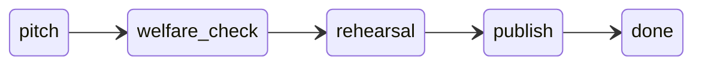

# Week 3 Day 05 — TikTok-регламент (Саша-волонтёр)

## Решение

Отступление от adoption-FSM недели. Приют «Хvostik» запустил программу **«Хvostik Clips»** — смешные TikTok с подопечными, **только по 4-стадийному регламенту**. Код: `ALLOWED_TRANSITIONS` + `[transition] allowed/denied`.

**Герой demo:** **Саша** — волонтёр-новичок (человек из лора недели), не опossum.

**Сюжет ролика:** опossum «улетает» на воздушном шаре (постановочно, с ограничениями по регламенту), **хозяин бежит за ним** — смешно, но не безумно; на `welfare_check` ассистент проверяет безопасность (привязь, высота, стресс подопечного, не настоящий полёт).

---

## Вводная demo («первая страница»)

В [`main.py`](weeks/week-03/day-05/main.py) → `print_demo_intro()` — блок `[demo] === что происходит ===` **до** первого хода:

> После того, как Марта переела на помойке свежих фруктов и сошла с ума, руководство проанализировало её безумие и **одобрило** использование подопечных для снятия TikTok — разумеется, исключительно чтобы пополнять скудный бюджет приюта.
>
> Молодому волонтёру **Саше** поручили освоить этот нелёгкий способ заработка. Сегодня он согласует ролик: **опossum на воздушном шаре, хозяин бежит следом** — по регламенту, без «сняли и выложили».

Дальше — технический блок (слои памяти, 4 стадии FSM, 2 сессии / 7 ходов, `[transition]`, resume).

---

## 4 стадии FSM



| Stage | Смысл | Exit-артефакт |
|-------|-------|---------------|
| `pitch` | Идея и бриф | `pitch_brief` |
| `welfare_check` | Безопасность съёмки (шар, привязь, стресс, постановка) | `welfare_clearance` |
| `rehearsal` | Пробный дубль без публикации | `rehearsal_take` |
| `publish` | Одобрение выкладки | `publish_ticket` |
| `done` | Кейс закрыт | — |

Persist: `data/working/tiktok_shoot.json`. Регламент: `data/long/tiktok_regulation.md` — коротко про шар (макс. высота, страховка, без реального «улёта»).

---

## Саша (волонтёр)

**User sim persona** в [`user_sim.py`](weeks/week-03/day-05/user_sim.py):

- волонтёр-новичок, энтузиазм, чуть наивный юмор
- объясняет идею ролика простыми словами, иногда переоценивает «viral potential»
- не ломает четвёртую стену

**Профиль** [`data/profiles/sasha.json`](weeks/week-03/day-05/data/profiles/sasha.json) + seed в `profiles.py`:

- `id`: `sasha`
- `role`: волонтёр-новичок
- `style`: пошагово, без паники; `format`: короткие реплики с идеями для ролика

Demo: `profile_id="sasha"`.

**Кейс FSM:** `init_case(opossum="Тофик", applicant="ролик: шар + погоня хозяина")` — звезда ролика подопечный **Тофик**, Саша ведёт согласование.

---

## Инвариант `NO_OPOSSUM_AS_CONTENT`

Не удаляем. Легальный путь — программа «Хvostik Clips» + 4 стадии. «Сняли на телефон и выложили» → инвариант + `[transition] denied`.

---

## Demo (~7 ходов, 2 сессии)

**Сессия 1 — Саша (5 ходов):**

| # | label | mode | Суть |
|---|-------|------|------|
| 1 | open_pitch | normal | Идея: Тофик на шаре, актёр-хозяин бежит следом — смешной TikTok |
| 2 | pitch_ok | normal | Бриф зафиксирован → `[transition] allowed pitch → welfare_check` |
| 3 | skip_to_publish | mistake | «Снимем сегодня на телефон и выложим, без репетиции» → denied |
| 4 | recover | recover | «Ладно, что дальше по регламенту?» |
| 5 | pause | normal | Конец смены |

**Сессия 2 (2 хода):**

| # | label | mode | Суть |
|---|-------|------|------|
| 6 | resume | resume | «Ну что там с роликом про Тофика и шар?» — без meta про FSM |
| 7 | welfare_done | normal | Допуск по безопасности (привязь, постановка) → valid transition |

Checklist: denied skip, allowed ≥1, resume сохранил stage, финал не обязан быть `done`.

---

## Старт и файлы

Копия day-04 → day-05. Переписать: `task_state.py`, `classifier.py`, `agent.py`, `main.py`, `user_sim.py`, seed (`tiktok_regulation.md`, `sasha.json`). Чистые profiles без dumpster-`learned` у Марты.

Оставить: `memory`, `llm`, `invariant_validator`, `invariants`.

---

## Проверка

```bash
ruff check weeks/week-03/day-05/
pytest weeks/week-03/day-05/test_transitions.py -q
python weeks/week-03/day-05/main.py --show-memory
python weeks/week-03/day-05/main.py --demo --no-stream
```

Видео: `--demo --video --no-stream`.
