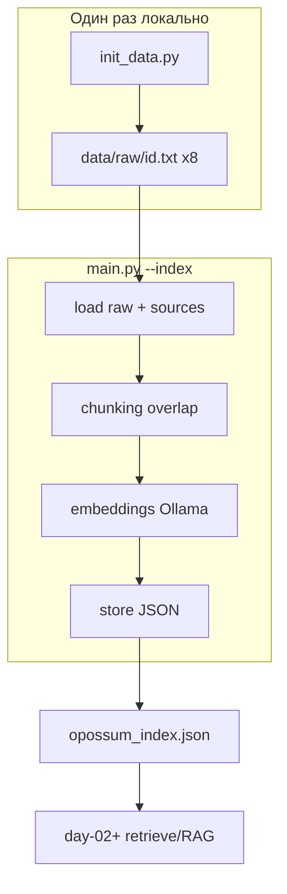

# Week 5 Day 1: индексация документов (корпус — опоссумы)

## Формулировка задания (курс)

- Набор документов: минимум 20–30 страниц текста суммарно.
- Пайплайн: **chunking → embeddings → сохранение индекса** (JSON).
- Усиление: **метаданные** к каждому чанку (`source`, `title/file`, `section`, `chunk_id`).
- В задании упоминаются две стратегии chunking (fixed + structural) — **по вашему решению делаем одну: overlap** (fixed-size + перекрытие на границах).

## Ваши решения (зафиксированы)

| Тема | Решение |
|------|---------|
| Формат индекса | JSON, **один файл на всю неделю** — последующие дни читают его |
| Тематика | Опоссумы, 8 книг Project Gutenberg |
| Эмбеддинги | **Ollama + `nomic-embed-text`** локально |
| Raw-тексты | Отдельный **`init_data.py`**, не в `main.py` |
| Git | **`weeks/week-05/data/` целиком не коммитим** |
| Наблюдаемость | Этапы, прогресс, ETA; без дампа текстов/векторов |
| Правила недели | После реализации обновить **`week-05.mdc`** |

---

## Архитектура



**Два entry point, общие модули:**

- `init_data.py` — только сеть + запись raw.
- `main.py` — только чтение raw + индекс; **не качает**.

**Пути (week-level data из day-01):**

```python
WEEK_DIR = Path(__file__).resolve().parents[1]   # weeks/week-05/
DATA_DIR = WEEK_DIR / "data"
RAW_DIR = DATA_DIR / "raw"
INDEX_PATH = DATA_DIR / "opossum_index.json"
```

Day-02+ используют тот же `INDEX_PATH` (свой код, тот же файл).

---

## Git

[`.gitignore`](.gitignore) — добавить:

```
weeks/week-05/data/
```

Перед `/finish_day`: `main.py --clear` (удаляет индекс). Raw остаётся локально — в коммит не попадает благодаря gitignore.

---

## Корпус: 8 книг (hardcoded в `sources.py`)

Plain text UTF-8, public domain. Суммарно ~1.5 MB — сильно больше минимума задания.

| ID | Файл | Название | Автор | Тип |
|----|------|----------|-------|-----|
| 14732 | `14732.txt` | The Adventures of Unc' Billy Possum | Thornton W. Burgess | худ. проза |
| 50881 | `50881.txt` | 'Possum | Mary Grant Bruce | худ. проза (AU) |
| 2441 | `2441.txt` | The Burgess Animal Book for Children | Thornton W. Burgess | натуралистика (гл. Virginia Opossum) |
| 14958 | `14958.txt` | Mother West Wind "Why" Stories | Thornton W. Burgess | рассказы (Unc' Billy plays dead) |
| 37199 | `37199.txt` | Ecology of the Opossum | Fitch & Sandidge | научная монография |
| 59475 | `59475.txt` | Wild Animals of North America | Edward W. Nelson | натуралистика (раздел opossum) |
| 43558 | `43558.txt` | The Sandman's Hour | Abbie Phillips Walker | детские истории |
| 60659 | `60659.txt` | Wild Kindred | Jean M. Thompson | «The Trials of Peter Possum» |

**URL-шаблон** (полные URL в `sources.py`):

```
https://www.gutenberg.org/ebooks/{id}.txt.utf-8
```

`sources.py` — единый каталог `BOOKS: list[Book]` с полями `id`, `title`, `author`, `url`, `filename`. Импортируется и в `init_data.py`, и в `main.py`.

---

## Структура файлов day-01

```
weeks/week-05/
  data/                    # gitignore
    raw/{id}.txt
    opossum_index.json
  day-01/
    init_data.py             # скачивание raw
    main.py                  # CLI индексации
    sources.py               # каталог книг + URL
    paths.py                 # WEEK_DIR, DATA_DIR, RAW_DIR, INDEX_PATH
    chunking.py              # overlap + section
    embeddings.py            # Ollama client
    store.py                 # JSON load/save/validate
    progress.py              # таймер, ETA, форматирование логов
    requirements.txt         # requests
    README.md
```

**Scope day-01 — только индекс.** Не делаем: retrieve, rerank, RAG-агент, Dockhost/LLM (это следующие дни).

**Без `--demo`** (правило week-05).

---

## `init_data.py`

**Поведение:**
- Для каждой книги из `sources.BOOKS`: `GET url` (`requests`, timeout 60s, User-Agent).
- Strip Gutenberg boilerplate: regex от `*** START OF` до начала текста и от `*** END OF` до конца.
- Запись в `RAW_DIR / f"{id}.txt"`, mkdir parents.
- Файл уже есть → skip (лог `[init] skip 14732 (exists)`); `--force` → перекачать.
- Ошибка сети/404 → `[error]` + exit 1 с указанием книги.

**Логи (`[init]`):**
```
[init] download 1/8 14732 The Adventures of Unc' Billy Possum
[init] saved 14732.txt (98 KB)
[init] skip 50881 (exists)
[init] done: 8/8 books, 1.4 MB total → weeks/week-05/data/raw/
```

**Запуск:**
```bash
python weeks/week-05/day-01/init_data.py
python weeks/week-05/day-01/init_data.py --force
```

---

## Чанкинг: overlap (единственная стратегия)

Параметры (константы в `chunking.py`, попадают в JSON):

| Параметр | Значение | Обоснование |
|----------|----------|-------------|
| `chunk_chars` | 3200 | ~800 токенов (ориентир лекции 500–1000) |
| `overlap_chars` | 320 | ~10% перекрытие на границах |

**Алгоритм:**
1. Sliding window: следующий чанк начинается на `end - overlap`.
2. Граница `end` — ближайший пробел или `\n` ≤ `start + chunk_chars` (не резать слово).
3. Последний чанк — хвост текста (может быть короче окна).
4. Пустые чанки после strip — пропускать.

**Overlap (иллюстрация):**
```
[0 -------- 3200]
      [2880 -------- 6080]
            [5760 -------- 8960]
```

**Section (метаданные, не режет текст):**
- Один проход по строкам книги → список `(char_offset, heading_text)`.
- Regex заголовков Gutenberg:
  - `^CHAPTER [IVXLCDM\d]+`
  - `^[IVXLCDM]+\.\s+[A-Z]` (Burgess chapters)
  - `^### .+`
  - ALL CAPS строки ≤ 80 символов после пустой строки (fallback)
- Для чанка с `start_offset` — последний heading где `offset <= start_offset`; иначе `"intro"`.

---

## Метаданные — что кладём и почему

В задании перечислены `source`, `title/file`, `section`, `chunk_id` как **усиление**, без жёсткой схемы. Ниже — **наш** минимально достаточный набор для RAG, цитирования источников и отладки индекса.

### Разделение: payload vs meta

Каждый элемент `chunks[]` — **три части**:

| Часть | Поля | Назначение |
|-------|------|------------|
| **Payload** (не метаданные) | `text`, `embedding` | Содержимое для поиска и подстановки в prompt |
| **Meta** | объект `meta` | Всё описательное: откуда чанк, как идентифицировать, контекст |

`text` и `embedding` **не** дублируем внутри `meta`.

### Объект `meta` — фиксированный список полей

| Поле | Тип | Зачем |
|------|-----|-------|
| `chunk_id` | string | Стабильный ключ: `{source_id}:{index}` (напр. `14732:012`); цитирование в RAG |
| `source_id` | string | ID книги (Gutenberg); фильтрация без парсинга `chunk_id` |
| `title` | string | Название книги — для человекочитаемых ссылок |
| `author` | string | Автор — атрибуция в ответах («по Burgess…») |
| `section` | string | Ближайший заголовок/глава; `"intro"` если заголовков не было |
| `char_count` | int | Длина `text`; фильтрация коротких чанков в retrieve |
| `start_offset` | int | Символ начала чанка в исходном тексте книги |
| `end_offset` | int | Символ конца (exclusive); видно overlap между соседними чанками |

**Убрано:**
- ~~`source_file`~~ — файл однозначно `{source_id}.txt` по каталогу `sources[]`.
- ~~`chunk_index`~~ — дублирует суффикс в `chunk_id` (`14732:012` → index = 12); при необходимости парсится из `chunk_id`.

**Не включаем в meta:** `text`, `embedding`, параметры chunking (они в корне индекса), `created_at` (в корне).

**Почему offsets:** при overlap соседние чанки пересекаются — offsets показывают это явно; пригодится для re-index и dedup на следующих днях.

Корневой массив `sources[]` — справочник книг (дублирует title/author один раз на книгу). В `meta` author/title **дублируем намеренно**, чтобы один chunk был самодостаточен при retrieve без join с `sources[]`.

---

## JSON-схема (`opossum_index.json`)

**Корень:**

```json
{
  "version": 1,
  "corpus": "opossums",
  "created_at": "2026-07-05T10:00:00+00:00",
  "chunking": {
    "strategy": "overlap",
    "chunk_chars": 3200,
    "overlap_chars": 320
  },
  "embedding": {
    "provider": "ollama",
    "model": "nomic-embed-text",
    "dim": 768,
    "base_url": "http://localhost:11434"
  },
  "stats": {
    "books": 8,
    "chunks": 412,
    "avg_chars": 2980,
    "total_chars": 1228960
  },
  "sources": [
    {
      "id": "14732",
      "title": "The Adventures of Unc' Billy Possum",
      "author": "Thornton W. Burgess",
      "file": "14732.txt"
    }
  ],
  "chunks": []
}
```

**Один chunk** (payload + `meta`):

```json
{
  "text": "Unc' Billy Possum grinned...",
  "embedding": [0.012, -0.034, "... 768 floats"],
  "meta": {
    "chunk_id": "14732:012",
    "source_id": "14732",
    "title": "The Adventures of Unc' Billy Possum",
    "author": "Thornton W. Burgess",
    "section": "XXI. FARMER BROWN'S BOY CHOPS DOWN A TREE",
    "char_count": 2840,
    "start_offset": 34560,
    "end_offset": 37400
  }
}
```

`store.py`: запись через temp-файл + rename (атомарно). Оценка размера ~4–6 MB (сотни чанков × 768 float) — приемлемо для JSON.

---

## Эмбеддинги: Ollama + nomic-embed-text

### Почему эта модель

- Рекомендация лекции и [`week-05.mdc`](.cursor/rules/week-05.mdc).
- ~274 MB, 768 dim, хорошее качество/скорость на CPU.
- Альтернатива `mxbai-embed-large` — тяжелее; для day-1 не нужна.

### Установка (инструкции в README)

```bash
# Linux
curl -fsSL https://ollama.com/install.sh | sh
ollama serve   # если не systemd

ollama pull nomic-embed-text

# проверка
curl http://localhost:11434/api/embeddings \
  -d '{"model":"nomic-embed-text","prompt":"Virginia opossum"}'
```

### Переменные окружения

| Переменная | Default |
|------------|---------|
| `OLLAMA_BASE_URL` | `http://localhost:11434` |
| `OLLAMA_EMBED_MODEL` | `nomic-embed-text` |

На VPS — `OLLAMA_BASE_URL` = адрес сервера.

### `embeddings.py`

- Healthcheck в начале `--index`: `GET /api/tags` или probe embed; недоступен → `[error] Ollama недоступен…` + exit 1.
- `POST {base}/api/embeddings` body: `{"model": model, "prompt": text}`.
- Ответ: `response["embedding"]` — list[float], len=768.
- Последовательные вызовы (Ollama без batch API).
- **Не смешивать** с `complete()` для Dockhost — в day-01 LLM нет вообще.

---

## Наблюдаемость

### `progress.py`

- `StageTimer` — elapsed с начала этапа/всего пайплайна.
- `EmbedProgress(current, total)` — ETA после 5+ чанков (скользящее среднее sec/chunk).
- Формат: `45/412 (11%) elapsed 1m20s ETA ~10m`
- Печать: каждые **10 чанков** или **30 сек** (что раньше).

### Этапы `main.py --index` (`[index]`)

| Этап | Что логируем |
|------|--------------|
| `load` | N/8 книг найдено, missing → error; суммарный KB |
| `chunk` | книга i/8 → M chunks; итого |
| `embed` | прогресс + ETA (основное время) |
| `save` | путь, размер MB |
| `done` | chunks, books, wall time; sample: `meta.chunk_id`, `meta.section`, `meta.char_count` — **без text/embedding** |

### `init_data.py` — префикс `[init]`, см. выше.

### Чего не печатать

- Полный `text` чанков, массивы `embedding`, промпты.
- Sample в конце — только id + section + char_count.

### Если raw пуст

```
[error] data/raw пуст — сначала: python weeks/week-05/day-01/init_data.py
[error] ожидаются: 14732.txt, 50881.txt, …
```

---

## CLI `main.py`

| Флаг | Назначение |
|------|------------|
| `--index` | load → chunk → embed → save |
| `--show-index` | stats из JSON; **без Ollama**; exit 0 если индекса нет (пустая stats) |
| `--clear` | удалить `opossum_index.json` |
| `--help` | справка |

**Сдача на видео** (две команды подряд, весь stdout виден):

```bash
python weeks/week-05/day-01/init_data.py
python weeks/week-05/day-01/main.py --index
```

**Smoke / finish_day** (без Ollama, без полного `--index`):

```bash
ruff check weeks/week-05/day-01/
python weeks/week-05/day-01/main.py --show-index
python weeks/week-05/day-01/main.py --clear
```

**Проверка после кода** (локально, один раз): `init_data.py` + `--index` с запущенным Ollama.

---

## README day-01

Заполнить шаблон [`weeks/week-05/day-01/README.md`](weeks/week-05/day-01/README.md):

- **Задание** — формулировка курса + наши решения (overlap, opossums, JSON на неделю).
- **Результат** — что видно на видео (init → index, прогресс, stats).
- **Setup** — venv, `pip install -r requirements.txt`, Ollama + pull.
- **Команды** — init_data, --index, --show-index, --clear.
- **Метаданные** — таблица полей `meta` (отдельно от `text`/`embedding`).
- **Пути** — `weeks/week-05/data/`, не коммитить.
- **Статус** — чеклист сдачи.

---

## Обновление `week-05.mdc` (после реализации)

Заменить/дополнить (сейчас там «нет единого домена» — противоречит сквозному корпусу):

1. **Сквозной корпус недели** — тема **опоссумы**, 8 книг Gutenberg.
2. **Общий индекс** — `weeks/week-05/data/opossum_index.json`; day-01 строит, day-02+ читают.
3. **Инициализация raw** — `python weeks/week-05/day-01/init_data.py` перед первым `--index`.
4. **`data/` локально** — вся папка в gitignore, не коммитить.
5. **JSON schema** — chunk = `{text, embedding, meta}`; поля `meta` — см. план; `chunking.strategy=overlap`.
6. **finish_day** — `--clear` индекса; smoke `--show-index`.
7. Сохранить без изменений: Ollama embed, Dockhost для генерации (след. дни), без `--demo`.

---

## Журнал

Создать [`journal/week-05/day-01.md`](journal/week-05/day-01.md):

- init_data + main, overlap chunking, Ollama nomic-embed-text.
- Общий JSON на неделю, data/ в gitignore.
- Что показать на видео.

---

## Чего не делать

- Retrieve, rerank, RAG-чат, Dockhost LLM — scope следующих дней.
- `--demo`.
- Коммитить `weeks/week-05/data/`.
- Дампить embedding/text в stdout.
- Копировать код из week-04 / соседних day-DD.
- Общий Python-пакет на всю неделю (только общий **файл данных**).
