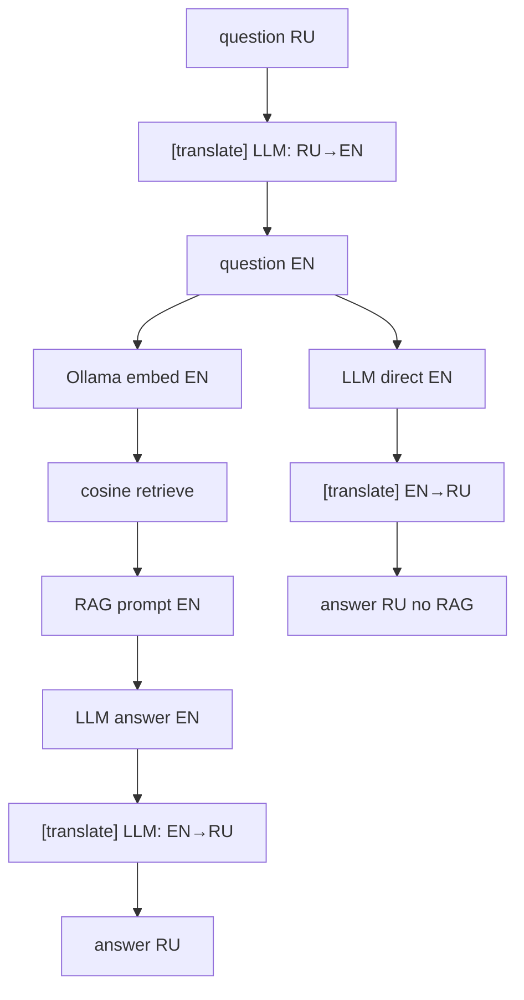

# Week 5 Day 2: первый RAG-запрос (+ слой перевода)

## Контекст

- **Day-01** (`[weeks/week-05/day-01/](weeks/week-05/day-01/)`) строит `[weeks/week-05/data/opossum_index.json](weeks/week-05/data/opossum_index.json)` — 8 книг на **английском**, ~480 чанков.
- **Day-02** — самодостаточная папка, без импортов из `day-01/`.
- **Не в scope:** rerank, чат-цикл, повторный `--index`, агент с tools.
- **Исключение по `--demo`:** в `[week-05.mdc](.cursor/rules/week-05.mdc)` demo по умолчанию запрещён, но **для day-02 пользователь явно просит `--demo`** — сценарий сдачи на видео.

## Слой перевода (RU → EN → RU)

Корпус и эмбеддинги — **английский**. Пользователь задаёт вопрос **на русском**.




**Модуль `[translate.py](weeks/week-05/day-02/translate.py)`:**

- `translate_to_en(text_ru) -> str` — один вызов `complete()`; system: «Translate to English. Output only the translation, no commentary.»
- `translate_to_ru(text_en) -> str` — обратно для финального ответа.
- В stdout: `[translate] ru→en: <превью ~80 символов>` и `[translate] en→ru: done` (без полного текста).

**Retrieve и RAG-prompts** — только на **EN** (вопрос после перевода, контекст чанков как в индексе, инструкции LLM на EN).

**Ответ пользователю** — всегда **RU** (после перевода ответа LLM).

**Без RAG:** RU → EN → LLM (вопрос EN, без контекста) → EN → RU.

## Пайплайн RAG

**Retrieve:** embed **EN-вопроса** → cosine vs `chunks[].embedding` → top-**k=4**.

**Prompt (RAG, EN):**

```
Answer using only the excerpts below. Cite sources (book title, section).
---
[1] title / section (chunk_id)
<text preview ~600 chars>
---
Question: …
```

**Stdout:** `[translate]`, `[retrieve]`, `[rag]`, `[retry]`; чанки — meta + score, без полного text/embedding.

## Структура файлов day-02


| Файл                                                        | Назначение                                         |
| ----------------------------------------------------------- | -------------------------------------------------- |
| `[paths.py](weeks/week-05/day-02/paths.py)`                 | `INDEX_PATH`                                       |
| `[store.py](weeks/week-05/day-02/store.py)`                 | `load_index()`, ошибка если индекса нет            |
| `[embeddings.py](weeks/week-05/day-02/embeddings.py)`       | `embed_text()`, `check_ollama()`                   |
| `[llm.py](weeks/week-05/day-02/llm.py)`                     | `complete()` с ретраями                            |
| `[translate.py](weeks/week-05/day-02/translate.py)`         | `translate_to_en`, `translate_to_ru`               |
| `[retrieve.py](weeks/week-05/day-02/retrieve.py)`           | cosine + top-k                                     |
| `[rag.py](weeks/week-05/day-02/rag.py)`                     | prompts EN, `ask_with_rag`, `ask_without_rag` → RU |
| `[questions.py](weeks/week-05/day-02/questions.py)`         | 10 `DemoQuestion` на русском                       |
| `[main.py](weeks/week-05/day-02/main.py)`                   | CLI + demo runner                                  |
| `[requirements.txt](weeks/week-05/day-02/requirements.txt)` | `requests`, `python-dotenv`                        |
| `[README.md](weeks/week-05/day-02/README.md)`               | setup, команды, `--demo` для видео                 |
| `[journal/week-05/day-02.md](journal/week-05/day-02.md)`    | заметки                                            |


## CLI

```bash
# один вопрос (RU) — RAG, ответ RU
python weeks/week-05/day-02/main.py --ask "Почему дядюшка Билли Опоссум притворяется мёртвым, а не убегает?"

# без RAG
python weeks/week-05/day-02/main.py --ask "…" --no-rag

# сравнение двух режимов на одном вопросе
python weeks/week-05/day-02/main.py --compare "Какие дикие плоды преобладали в помёте опоссумов осенью?"

# демо: 10 вопросов, постранично (сценарий для видео)
python weeks/week-05/day-02/main.py --demo

# демо без паузы (отладка / CI не гонять — только локально)
python weeks/week-05/day-02/main.py --demo --no-pause

# smoke без Ollama/LLM
python weeks/week-05/day-02/main.py --show-index
```

## Режим `--demo`

**10 зашитых вопросов** из `[questions.py](weeks/week-05/day-02/questions.py)` — см. таблицу ниже.

**На каждый вопрос — отдельная «страница» в консоли:**

1. Очистка экрана (`os.system("clear")` / `cls`) или разделитель `===` + пустые строки.
2. Заголовок: `[demo] вопрос 3/10`.
3. Текст вопроса (RU).
4. `[translate] ru→en` — превью EN-версии.
5. `[retrieve]` — top-k (chunk_id, title, section, score).
6. `[expect]` — ожидаемый ответ (RU) + список источников (`source_id`, title).
7. `[rag] with` — **полный** ответ с RAG (RU).
8. `[rag] without` — **полный** ответ без RAG (RU).
9. Пауза: `Enter — следующий вопрос` (если не `--no-pause`).

В начале `--demo` — краткий блок `[demo]`: что будет показано (RU→EN retrieve, RAG vs no-RAG, 10 вопросов).

**Стоимость:** ~3 LLM-вызова на вопрос (translate×2 + 2× answer) × 10 — только для записи видео; smoke-test **не** гоняет `--demo`.

## 10 демо-вопросов (RU)

Все вопросы — **на русском**, грамотным связным языком (ввод пользователя). Английские версии для retrieve и RAG-промпта генерируются в runtime через `translate_to_en`; здесь приведены только для справки. Названия книг и персонажей оставлены в оригинале (как имена собственные), но обрамлены в русский текст без смешения кириллицы и латиницы внутри одного слова.

### Q1 — «игра мёртвого»


|                        |                                                                                                                                                                                                                                                                                     |
| ---------------------- | ----------------------------------------------------------------------------------------------------------------------------------------------------------------------------------------------------------------------------------------------------------------------------------- |
| **Вопрос (RU)**        | Почему дядюшка Билли Опоссум притворяется мёртвым вместо того, чтобы убегать?                                                                                                                                                                                                       |
| **Ожидание (RAG, RU)** | Притворство мёртвым — защитная реакция. По сказке Бёрджесса это семейная черта: предок дядюшки Билли одурачивал медведя таким трюком. Зоологически — опоссум медлителен, не может убежать от хищника и вместо этого полагается на пассивную оборону (обмякает, «выглядит мёртвым»). |
| **Источники**          | **14958** — *Mother West Wind "Why" Stories*, глава «Why Unc' Billy Possum Plays Dead»; **2441** — *The Burgess Animal Book*, гл. XXXIV; **59475** — *Wild Animals of North America* (само выражение «playing possum»)                                                              |
| **Без RAG**            | Общие рассуждения об опоссумах и притворстве смерти без опоры на конкретный сюжет — не всплывут ни Дедушка Лягушка, ни история про медведя и предка.                                                                                                                                |


### Q2 — рацион по данным полевого исследования


|                        |                                                                                                                                                                                                                                |
| ---------------------- | ------------------------------------------------------------------------------------------------------------------------------------------------------------------------------------------------------------------------------ |
| **Вопрос (RU)**        | Какие дикие плоды преобладали в помёте опоссумов осенью по данным исследования Фитча на биологической резервации в Канзасе?                                                                                                    |
| **Ожидание (RAG, RU)** | На первом месте дикий виноград, на втором — каркас (hackberry); также встречаются дикая слива и дикая яблоня. Отмечается сезонность (пик — октябрь–ноябрь) и то, что ловушки лучше всего работали у зарослей дикого винограда. |
| **Источники**          | **37199** — *Ecology of the Opossum* (Fitch & Sandidge), раздел с анализом помёта                                                                                                                                              |
| **Без RAG**            | Общее «опоссумы всеядны, едят фрукты и мелких животных» — без винограда, каркаса и привязки к конкретному исследованию в Канзасе.                                                                                              |


### Q3 — размножение


|                        |                                                                                                                                                                                                                  |
| ---------------------- | ---------------------------------------------------------------------------------------------------------------------------------------------------------------------------------------------------------------- |
| **Вопрос (RU)**        | Сколько детёнышей может быть у виргинского опоссума и как они развиваются после рождения?                                                                                                                        |
| **Ожидание (RAG, RU)** | От 5 до 14 детёнышей за помёт. Рождаются в зачаточном, почти эмбриональном состоянии и сразу прикрепляются к соскам в сумке матери; позже, обрастая шерстью, начинают цепляться за её мех, когда покидают сумку. |
| **Источники**          | **59475** — Nelson, раздел про виргинского опоссума; **2441** — рассказ Матушки Природы о сумчатых                                                                                                               |
| **Без RAG**            | Модель может верно назвать наличие сумки и общий диапазон детёнышей, но часто путается в цифрах и деталях развития без опоры на текст.                                                                           |


### Q4 — сюжет «Приключений дядюшки Билли Опоссума» (проверка на галлюцинацию)


|                        |                                                                                                                                                                                                       |
| ---------------------- | ----------------------------------------------------------------------------------------------------------------------------------------------------------------------------------------------------- |
| **Вопрос (RU)**        | Почему в начале книги «Приключения дядюшки Билли Опоссума» лесные звери считают, что он погиб?                                                                                                        |
| **Ожидание (RAG, RU)** | Сын фермера Брауна якобы видел дядюшку Билли мёртвым и рассказал об этом остальным зверям; на самом деле дядюшка Билли жив и в этот момент переживает собственное приключение (голод, ловушка, плен). |
| **Источники**          | **14732** — *The Adventures of Unc' Billy Possum*, глава I «Unc' Billy Possum Is Caught»                                                                                                              |
| **Без RAG**            | Выдуманный или обобщённый сюжет, не совпадающий с текстом книги — хороший контраст для демонстрации.                                                                                                  |


### Q5 — методология исследования Фитча


|                        |                                                                                                                                                                                                                                              |
| ---------------------- | -------------------------------------------------------------------------------------------------------------------------------------------------------------------------------------------------------------------------------------------- |
| **Вопрос (RU)**        | Как изучали опоссумов на биологической резервации в Канзасе и какую приманку использовали в ловушках?                                                                                                                                        |
| **Ожидание (RAG, RU)** | Живоловушки из металлической сетки; в качестве приманки — тушки мелких животных, мясные обрезки, консервированный собачий корм, конина, бекон-жир. Пойманных метили надрезами на пальцах и ушах. Всего поймано 117 опоссумов за 276 отловов. |
| **Источники**          | **37199** — раздел о методологии отлова                                                                                                                                                                                                      |
| **Без RAG**            | Общее «использовали ловушки», без размеров ловушек, состава приманки и конкретных цифр Фитча.                                                                                                                                                |


### Q6 — опоссум по имени Питер (Wild Kindred)


|                        |                                                                                                                            |
| ---------------------- | -------------------------------------------------------------------------------------------------------------------------- |
| **Вопрос (RU)**        | Сколько детёнышей было у опоссума Питера, когда пропала его подруга, и где находились малыши?                              |
| **Ожидание (RAG, RU)** | 11 детёнышей; они находились в бархатистой сумке матери на боку, размером с мышь, с розовыми носиками и голыми хвостиками. |
| **Источники**          | **60659** — *Wild Kindred*, глава «The Trials of Peter Possum»                                                             |
| **Без RAG**            | Не знает ни имени Питер, ни числа 11, ни болота с кипарисами — либо уклоняется, либо выдумывает детали.                    |


### Q7 — мистер Опоссум и мистер Медведь (сказка)


|                        |                                                                                                                                                         |
| ---------------------- | ------------------------------------------------------------------------------------------------------------------------------------------------------- |
| **Вопрос (RU)**        | Зачем мистер Опоссум пришёл к мистеру Медведю ранней весной в сказке «Час Песочного человека»?                                                          |
| **Ожидание (RAG, RU)** | Мистер Опоссум проснулся голодным, не смог напроситься на завтрак к соседям (белке, кролику) и решил застать медведя спящим, чтобы поживиться его едой. |
| **Источники**          | **43558** — *The Sandman's Hour*, глава «Mr. 'Possum»                                                                                                   |
| **Без RAG**            | Обобщённый ответ про опоссумов и медведей без привязки к сюжету конкретной сказки.                                                                      |


### Q8 — раки как основной корм


|                        |                                                                                                                                                  |
| ---------------------- | ------------------------------------------------------------------------------------------------------------------------------------------------ |
| **Вопрос (RU)**        | Какой животный корм был самым важным для опоссумов в холодное время года по данным исследования Фитча?                                           |
| **Ожидание (RAG, RU)** | Раки — главный источник животного корма в холодную половину года; их остатки встречались в помёте чаще, чем остатки любых других беспозвоночных. |
| **Источники**          | **37199** — раздел про содержимое помёта (упоминание раков)                                                                                      |
| **Без RAG**            | Общее «насекомые и мелкие животные» — без упоминания раков как доминирующего источника.                                                          |


### Q9 — история про спрятанный завтрак (Mother West Wind)


|                        |                                                                                                                                                                                                     |
| ---------------------- | --------------------------------------------------------------------------------------------------------------------------------------------------------------------------------------------------- |
| **Вопрос (RU)**        | Какую историю про старого Опоссума и завтрак Короля Медведя рассказывает Декдушка Лягушка?                                                                                                          |
| **Ожидание (RAG, RU)** | Старый Опоссум, предок дядюшки Билли, спрятал завтрак Короля Медведя, а затем «помогал» его искать, каждый раз незаметно перепрятывая еду в другое место, пока голодный медведь не пришёл в ярость. |
| **Источники**          | **14958** — глава «Why Unc' Billy Possum Plays Dead»                                                                                                                                                |
| **Без RAG**            | Не знает сюжет про спрятанный завтрак — либо выдумывает историю, либо отвечает общими словами про хитрость опоссумов.                                                                               |


### Q10 — рацион дядюшки Билли (Burgess)


|                        |                                                                                                                                                                                    |
| ---------------------- | ---------------------------------------------------------------------------------------------------------------------------------------------------------------------------------- |
| **Вопрос (RU)**        | Чем питается дядюшка Билли Опоссум согласно «Книге зверей» Бёрджесса?                                                                                                              |
| **Ожидание (RAG, RU)** | Насекомые, ягоды, фрукты, орехи, детёныши крыс и мышей, кукуруза, любое залежавшееся мясо — по словам самого дядюшки Билли, еду он найдёт «почти когда угодно и почти где угодно». |
| **Источники**          | **2441** — гл. XXXIV, прямая речь дядюшки Билли                                                                                                                                    |
| **Без RAG**            | Общее «всеяден» без конкретного перечня продуктов из книги.                                                                                                                        |


## README и видео

**Сценарий записи (одна команда):**

```bash
python weeks/week-05/day-02/main.py --demo
```

Предварительно: индекс построен (`day-01/init_data.py` → `day-01/main.py --index`). Индекс **не** `--clear` перед сдачей day-02.

**Smoke-test:** `ruff check weeks/week-05/day-02/` + `python weeks/week-05/day-02/main.py --show-index`. Один `--compare "Краткий вопрос"` — интеграционно при Ollama + ключе.

## Проверки

- Индекс отсутствует → «сначала day-01: init_data.py → main.py --index»
- Нет `DOCKHOST_AI_KEY` → exit 1 при `--ask` / `--compare` / `--demo`
- Ollama недоступен → exit 1 при retrieve (не при `--show-index`)
- Промпты и длинные чанки не дампятся целиком

## Зависимости от day-01

```bash
python weeks/week-05/day-01/init_data.py   # если raw пуст
python weeks/week-05/day-01/main.py --index
```

Индекс **не коммитим** и **не удаляем** при `/finish_day` day-02.