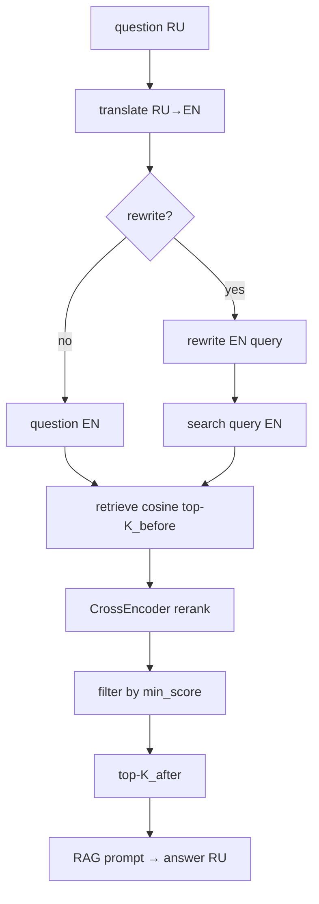

# Week 5 Day 3: rerank + query rewrite + сравнение режимов

## Контекст

- **День 23** = [`weeks/week-05/day-03/`](weeks/week-05/day-03/) (сейчас только пустой README).
- **Day-02** — базовый RAG: translate RU→EN, cosine retrieve (`top_k=10`), RAG через Dockhost, 10 демо-вопросов в [`questions.py`](weeks/week-05/day-02/questions.py).
- Индекс — [`weeks/week-05/data/opossum_index.json`](weeks/week-05/data/opossum_index.json) из day-01; не строим и не удаляем.
- **Query rewrite оставляем** — явное требование из блока «Результат» задания + подтверждение пользователя.
- **`--demo` на 10 вопросах day-02** — явный запрос пользователя (исключение из общего «без demo» в [`week-05.mdc`](.cursor/rules/week-05.mdc), по аналогии с day-02).

## Целевой пайплайн



**Два top-K и порог (настраиваемые):**

| Параметр | Default | CLI |
|----------|---------|-----|
| `retrieve_k` (до rerank) | 20 | `--retrieve-k` |
| `rag_k` (после filter) | 4 | `--rag-k` |
| `min_rerank_score` (порог CrossEncoder) | 0.15 | `--min-score` |

CrossEncoder: **`cross-encoder/ms-marco-MiniLM-L6-v2`** (лекция, ~22M, sigmoid 0–1). Lazy-load в `rerank.py`.

## 10 демо-вопросов (из day-02)

Скопировать **весь** [`DEMO_QUESTIONS`](weeks/week-05/day-02/questions.py) (10 шт., dataclass `DemoQuestion`) в [`weeks/week-05/day-03/questions.py`](weeks/week-05/day-03/questions.py) без сокращений — те же `question_ru`, `expect_ru`, `source_ids`, `source_titles`.

## Структура day-03

| Файл | Назначение |
|------|------------|
| paths, store, embeddings, llm, translate, console_out, retrieve, rag | копия day-02 (минимальные правки тегов) |
| **`rewrite.py`** | `rewrite_query(question_en) -> str`; stdout `[rewrite] before → after` (превью ~80 символов) |
| **`rerank.py`** | CrossEncoder + filter + top-K after |
| **`pipeline.py`** | `run_pipeline(..., mode)` → stats + answer |
| **`main.py`** | CLI |
| **`questions.py`** | **10 DEMO_QUESTIONS** (копия day-02) |
| requirements.txt | `requests`, `python-dotenv`, `sentence-transformers` |
| README.md, journal/week-05/day-03.md | |

### Query rewrite vs translate

- **Translate** — дословный RU→EN.
- **Rewrite** — LLM переформулирует EN под semantic search по корпусу opossum books; temperature 0.

### Stdout-теги

`[translate]`, `[rewrite]`, `[retrieve]`, `[rerank]`, `[rag]`, `[retry]`, `[error]`.

Пример rerank:

```
[retrieve] retrieve_k=20 hits=20 top_score=0.6123
[rerank] before=20 after=4 min_score=0.15 rag_k=4
  kept chunk_id=… rerank=0.87 embed=0.55
  dropped chunk_id=… rerank=0.08 (below threshold)
```

## Режимы

| Mode | translate | rewrite | retrieve_k | rerank+filter | rag_k |
|------|-----------|---------|------------|---------------|-------|
| `baseline` | ✓ | ✗ | 10 | ✗ | 10 |
| `rewrite` | ✓ | ✓ | 20 | ✗ | 4 |
| `full` | ✓ | ✓ | 20 | ✓ | 4 |

## CLI

```bash
# демо для видео — 10 вопросов из day-02, постранично
python weeks/week-05/day-03/main.py --demo
python weeks/week-05/day-03/main.py --demo --no-pause

# сравнение 3 режимов на одном вопросе
python weeks/week-05/day-03/main.py --compare-modes "…"

# полный пайплайн (default mode=full)
python weeks/week-05/day-03/main.py --ask "…"

# retrieve+rerank без ответа LLM
python weeks/week-05/day-03/main.py --retrieve "…" --mode full

# smoke без Ollama/LLM/CrossEncoder
python weeks/week-05/day-03/main.py --show-index
```

Флаги: `--mode`, `--no-rewrite`, `--no-rerank`, `--retrieve-k`, `--rag-k`, `--min-score`.

## Режим `--demo` (10 вопросов)

По образцу day-02, но с rerank/rewrite и сравнением режимов.

**На каждый из 10 вопросов — отдельная «страница»:**

1. Очистка экрана / разделитель.
2. `[demo] вопрос N/10` + текст вопроса (RU).
3. `[expect]` — ожидание + source_ids (из day-02).
4. `[translate]` ru→en (превью).
5. `[rewrite]` before→after (превью) — для mode `full`.
6. `[retrieve]` — top-K_before (chunk_id, score).
7. `[rerank]` — before/after, dropped/kept — для mode `full`.
8. `[mode] baseline` — краткий RAG-ответ (или только top chunks).
9. `[mode] full` — RAG-ответ с rewrite+rerank.
10. Пауза `Enter — следующий вопрос` (если не `--no-pause`).

В начале `--demo`: блок `[demo]` — что показываем (rewrite, rerank, baseline vs full, 10 вопросов).

**Стоимость:** ~4–5 LLM + 1 CrossEncoder batch на вопрос × 10 — только для записи видео. Smoke-test и `/finish_day` **не** гоняют `--demo`.

## README day-03

- Задание: CrossEncoder rerank + порог + query rewrite + сравнение режимов.
- **Видео:** одна команда `python weeks/week-05/day-03/main.py --demo`.
- Setup: venv, pip, индекс day-01, Ollama, Dockhost, первый прогон скачает CrossEncoder (~500MB).
- Smoke: `--show-index`.

## Проверки

1. `ruff check weeks/week-05/day-03/`
2. `python weeks/week-05/day-03/main.py --show-index` — exit 0
3. Один интеграционный: `--retrieve "…" --mode full` или `--compare-modes` с коротким вопросом
4. `/finish_day`: smoke только `--show-index`; индекс не коммитить

## Scope / не делать

- Не менять day-02.
- Не повторный `--index`, не day-04+ темы.
- Не дампить промпты, embeddings, полные чанки.

## Риски

- Первый CrossEncoder — интернет + download; документировать в README.
- Порог `0.15` — стартовый; при `after=0` warning и совет `--min-score`.
